# Admin User Management

This comprehensive document explains how to manage admin users in your portfolio application, including creating the first admin, managing existing admins, and understanding the underlying architecture.

## Table of Contents

- [System Architecture](#system-architecture)
- [Creating the First Admin User](#creating-the-first-admin-user)
- [Signing In with an Admin User](#signing-in-with-an-admin-user)
- [Managing Admin Users](#managing-admin-users)
  - [Creating Additional Admin Users](#creating-additional-admin-users)
  - [Updating Admin Users](#updating-admin-users)
  - [Deleting Admin Users](#deleting-admin-users)
- [Role and Permission System](#role-and-permission-system)
- [Troubleshooting](#troubleshooting)
- [Security Best Practices](#security-best-practices)

## System Architecture

The admin user management system is built on top of Supabase's authentication system with custom PostgreSQL functions and tables to manage roles and permissions.

### Database Schema

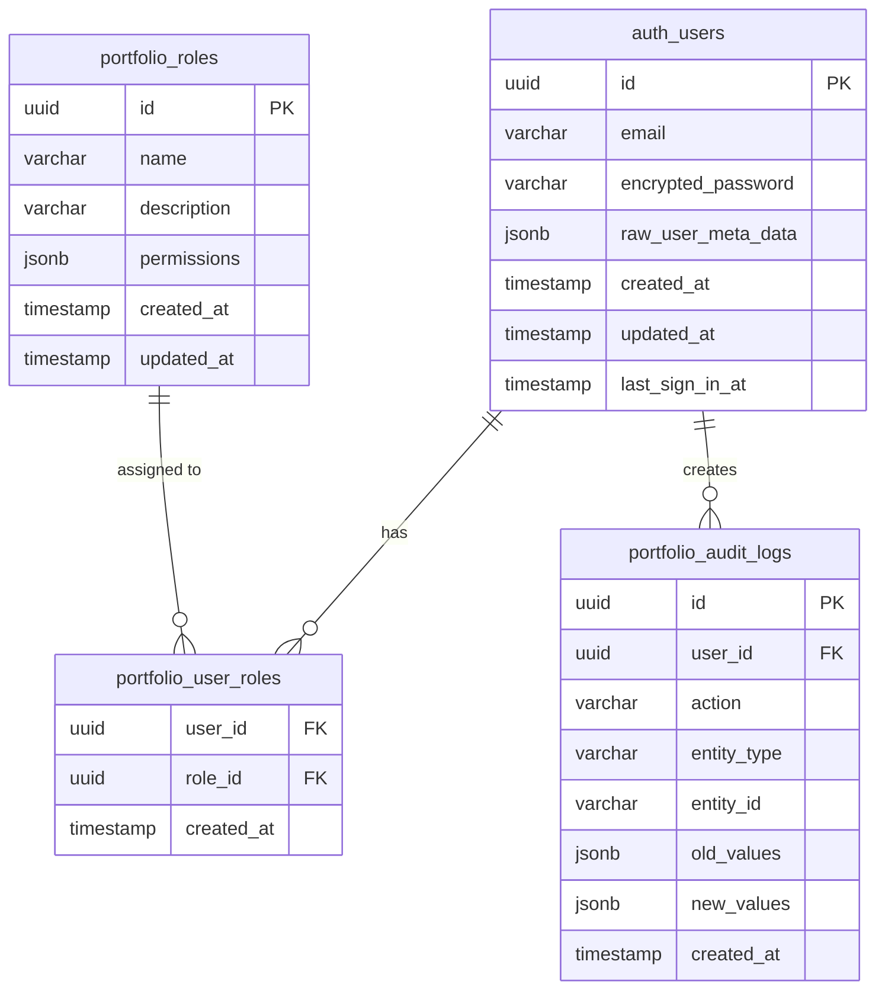

### Authentication Flow

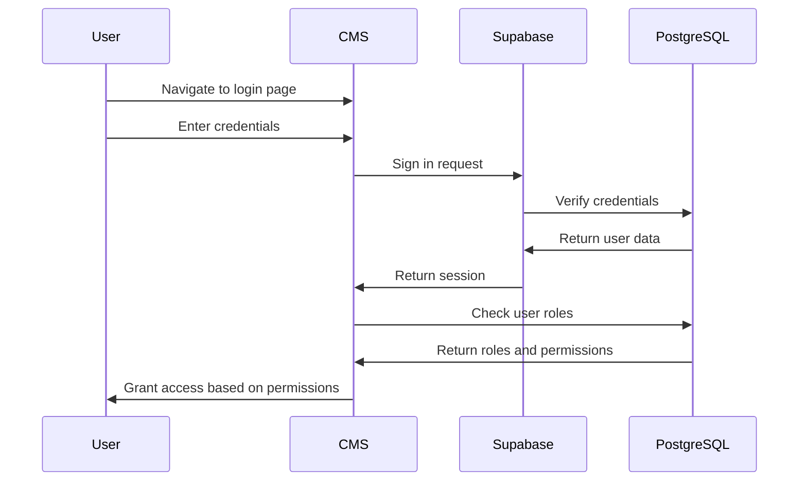

### Admin Creation Flow

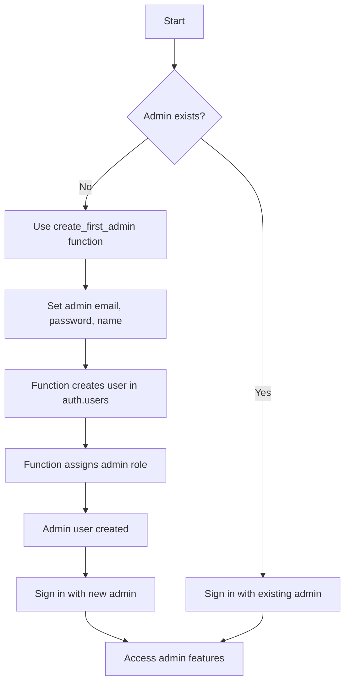

## Creating the First Admin User

You can create the first admin user using the following recommended approach:

### Prerequisites

Before creating the first admin user, make sure:

1. You have applied all the database migrations:

   ```bash
   supabase db push
   ```

2. The application is running and you can access the CMS login page.

### Recommended Approach: Using the Admin User Creation Script

The easiest way to create an admin user is to use the provided script:

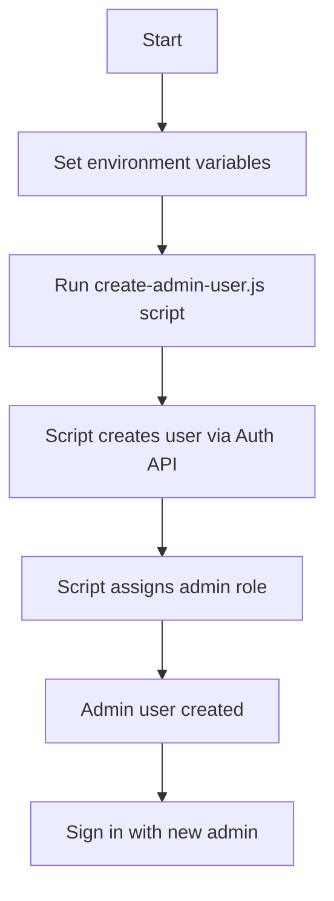

#### Using the Script

1. Make sure you have Node.js installed
2. Set up your environment variables in a `.env` file in the project root:

```python
SUPABASE_URL=https://your-project.supabase.co
SUPABASE_SERVICE_ROLE_KEY=your-service-role-key
ADMIN_EMAIL=admin@example.com
ADMIN_PASSWORD=securepassword
ADMIN_NAME=Admin User
```

3. Run the script:

```bash
node scripts/create-admin-user.js
```

4. The script will output the created user's details:

```markdown
Creating admin user with email: admin@example.com
Step 1: Creating user with Supabase Auth API...
User created successfully: { id: '...', email: 'admin@example.com', ... }
Step 2: Assigning admin role...
Admin role assigned successfully: { success: true, message: 'Admin role assigned to user ...', ... }

Admin user created/updated successfully!
--------------------------------
Email: admin@example.com
Password: securepassword
User ID: ...

You can now sign in to the CMS with these credentials.
```

### Alternative Manual Approaches

If you prefer to create an admin user manually, you can follow these steps:

#### Option A: Using the Supabase Dashboard

1. Go to your Supabase project dashboard
2. Navigate to Authentication > Users
3. Click "Add User"
4. Enter the email and password
5. Check "Auto-confirm email" if available
6. Click "Create User"
7. Note the UUID of the created user
8. Run the following SQL in the SQL Editor:

```sql
SELECT portfolio.assign_admin_role('USER_UUID_HERE'); -- Replace with the actual UUID
```

#### Option B: Using the Supabase JavaScript Client with Service Role Key

```javascript
// ES Module syntax
import { createClient } from '@supabase/supabase-js';
import 'dotenv/config';

// Use service role key for admin operations (NEVER expose this in client code)
const supabaseAdmin = createClient(
  'https://your-project.supabase.co',
  'your-service-role-key'
);

async function createAdminUser() {
  // Step 1: Create the user
  const { data, error } = await supabaseAdmin.auth.admin.createUser({
    email: 'admin@example.com',
    password: 'securepassword',
    email_confirm: true, // Automatically confirms the email
    user_metadata: {
      name: 'Admin User'
    }
  });

  if (error) {
    console.error('Error creating admin user:', error);
    return;
  }

  console.log('User created successfully:', data.user);
  const userId = data.user.id;

  // Step 2: Assign the admin role
  const { data: roleData, error: roleError } = await supabaseAdmin.rpc('assign_admin_role', {
    user_id: userId
  });

  if (roleError) {
    console.error('Error assigning admin role:', roleError);
    return;
  }

  console.log('Admin role assigned successfully:', roleData);
  return userId;
}
```

### Alternative Approaches

#### Using Direct SQL Function (Not Recommended for Authentication)

This approach may create users that cannot sign in properly:

```sql
SELECT portfolio.create_first_admin(
  'admin@example.com',  -- Replace with your admin email
  'securepassword',     -- Replace with a secure password
  'Admin User'          -- Replace with the admin's name
);
```

```javascript
// ES Module syntax
import { createClient } from '@supabase/supabase-js';

// Using the client-side supabase instance (not recommended for admin creation)
const supabase = createClient(
  'https://your-project.supabase.co',
  'your-anon-key'
);

async function createFirstAdmin() {
  const { data, error } = await supabase.rpc('create_first_admin', {
    admin_email: 'admin@example.com',
    admin_password: 'securepassword',
    admin_name: 'Admin User'
  });

  if (error) {
    console.error('Error creating first admin:', error);
    return;
  }

  console.log('First admin created successfully:', data);
}
```

## Signing In with an Admin User

After creating an admin user, you can sign in to the CMS:

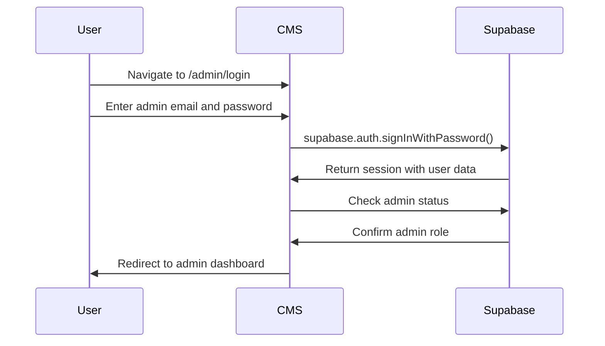

1. Navigate to the CMS login page (typically at `/admin/login` or similar)
2. Enter the email and password you used when creating the admin user
3. Click "Sign In"

You should now have access to all admin features, including user management.

## Managing Admin Users

### Creating Additional Admin Users

Once you're signed in as an admin, you can create additional admin users:

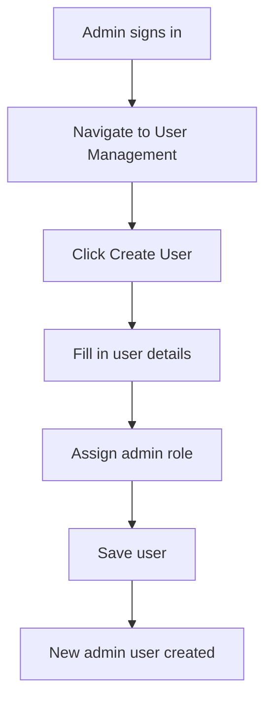

1. Navigate to the User Management section in the CMS
2. Click "Create User"
3. Fill in the user details
4. Assign the "admin" role to the new user
5. Save the user

The code behind this process uses the `create_user` function:

```javascript
const { data, error } = await supabase.rpc('create_user', {
  user_email: 'newadmin@example.com',
  user_password: 'securepassword',
  user_name: 'New Admin',
  user_roles: ['admin-role-uuid'] // UUID of the admin role
});
```

### Updating Admin Users

To update an existing admin user:

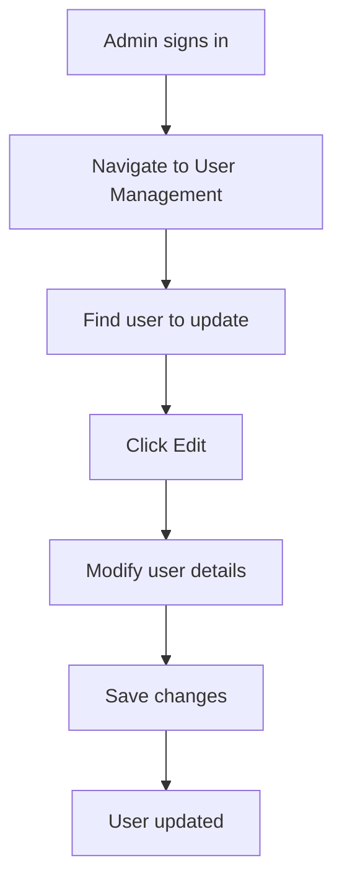

1. Navigate to the User Management section in the CMS
2. Find the user you want to update
3. Click "Edit" or the user's name
4. Modify the user details
5. Save the changes

The code behind this process uses the `update_user` function:

```javascript
const { data, error } = await supabase.rpc('update_user', {
  user_id: 'user-uuid',
  user_email: 'updated@example.com',
  user_password: null, // Keep current password if null
  user_name: 'Updated Name',
  user_roles: ['role-uuid-1', 'role-uuid-2']
});
```

### Deleting Admin Users

To delete an admin user:

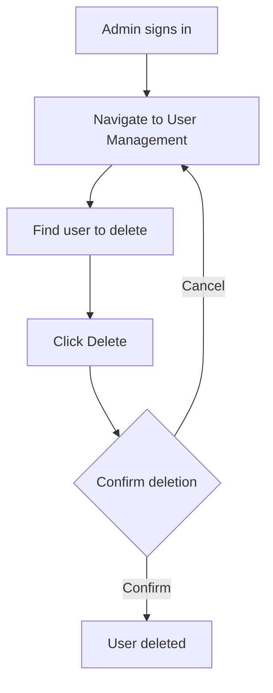

#### Option 1: Using the CMS Interface

1. Navigate to the User Management section in the CMS
2. Find the user you want to delete
3. Click "Delete" or the trash icon
4. Confirm the deletion

#### Option 2: Using the Supabase JavaScript Client

```javascript
import { supabase } from './lib/supabase';

async function deleteUser(userId) {
  const { data, error } = await supabase.rpc('delete_user', {
    in_user_id: userId
  });

  if (error) {
    console.error('Error deleting user:', error);
    return;
  }

  console.log('User deleted successfully:', data);
}

deleteUser('user-id-here'); // Replace with the actual UUID
```

#### Option 3: Using the SQL Function

You can delete an admin user by email using the `delete_admin_by_email` function:

```sql
SELECT portfolio.delete_admin_by_email('admin@example.com');
```

Or in JavaScript:

```javascript
const { data, error } = await supabase.rpc('delete_admin_by_email', {
  admin_email: 'admin@example.com'
});
```

## Role and Permission System

The admin management system uses a role-based access control (RBAC) system:

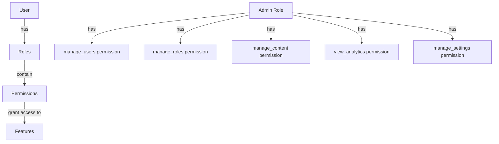

### Default Roles

1. **Admin**: Has all permissions
   - `manage_users`
   - `manage_roles`
   - `manage_content`
   - `view_analytics`
   - `manage_settings`

2. **Editor**: Has content management permissions
   - `manage_content`

### Permission Checks

Permission checks are performed using the `has_permission` function:

```javascript
const { data, error } = await supabase.rpc('has_permission', {
  user_id: 'user-uuid',
  permission: 'manage_users'
});

if (data) {
  // User has the permission
} else {
  // User does not have the permission
}
```

## Troubleshooting

### "An admin user already exists" Error

If you get an error saying "An admin user already exists", it means there's already at least one user with the admin role in the system. In this case, you should:

1. Sign in with an existing admin account, or
2. Contact another admin to create an account for you
3. If you need to reset the system, you can delete all admin users using the `delete_admin_by_email` function

### Password Issues

If you're having trouble signing in with the password you set:

1. Make sure you're using the correct email address
2. Check if caps lock is enabled
3. If you still can't sign in, you can reset the password using the Supabase Auth API or dashboard

### Permission Issues

If you've signed in but don't have access to user management:

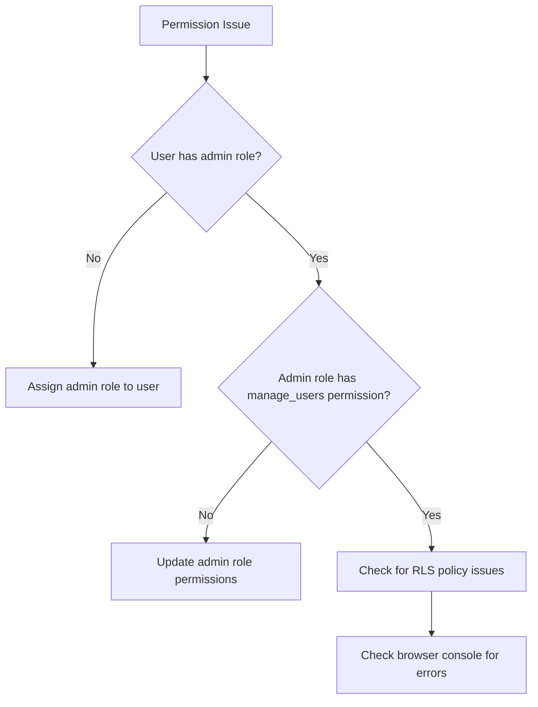

1. Check if your user has the "admin" role assigned
2. Verify that the admin role has the "manage_users" permission
3. Check the browser console for any error messages
4. Verify that the RLS policies are correctly set up

### Database Issues

If you're experiencing database-related issues:

1. Check the Supabase logs for any errors
2. Verify that all migrations have been applied correctly
3. Check that the RLS policies are correctly set up
4. Ensure that the functions have the correct permissions

## Security Best Practices

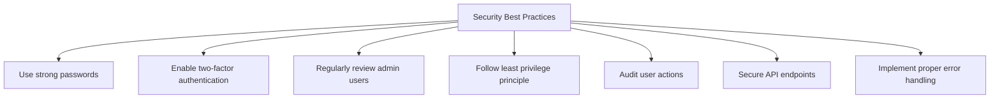

1. Use strong, unique passwords for admin accounts
2. Consider enabling two-factor authentication if available
3. Regularly review the list of admin users
4. Follow the principle of least privilege when assigning roles to new users
5. Implement audit logging for sensitive operations
6. Secure API endpoints with proper authentication and authorization
7. Implement proper error handling to prevent information leakage

## Technical Implementation Details

### Database Functions

The admin management system uses several PostgreSQL functions:

1. `assign_admin_role`: Assigns the admin role to an existing user (recommended for admin creation)
2. `create_first_admin`: Creates the first admin user when no admin exists (not recommended for authentication)
3. `create_user`: Creates a new user with specified roles
4. `update_user`: Updates an existing user's information and roles
5. `delete_user`: Deletes a user by ID
6. `delete_admin_by_email`: Deletes an admin user by email
7. `has_permission`: Checks if a user has a specific permission
8. `is_admin`: Checks if a user is an admin
9. `is_admin_current`: Checks if the current user is an admin
10. `get_user_roles`: Gets all roles assigned to a user
11. `get_users_with_roles`: Gets all users with their roles
12. `get_user_with_roles`: Gets a specific user with their roles
13. `search_users`: Searches for users by email or name

### Row-Level Security (RLS) Policies

The system uses RLS policies to secure the database tables:

1. `manage_user_roles`: Only admins can manage user roles
2. `manage_roles`: Only admins can manage roles
3. `view_audit_logs`: Only admins can view audit logs

### Client-Side Implementation

The client-side implementation uses React Query for data fetching and mutation:

```javascript
// Example of creating a user with React Query
const createUserMutation = useMutation({
  mutationFn: async (data) => {
    const { data: userData, error } = await supabase.rpc('create_user', {
      user_email: data.email,
      user_password: data.password,
      user_name: data.name,
      user_roles: data.roleIds
    });

    if (error) {
      throw new Error(error.message);
    }

    return userData;
  },
  onSuccess: () => {
    // Handle success
    queryClient.invalidateQueries(['users']);
    toast.success('User created successfully');
  },
  onError: (error) => {
    // Handle error
    toast.error(`Error creating user: ${error.message}`);
  }
});
```

## Conclusion

This document provides a comprehensive guide to managing admin users in your portfolio application. By following these instructions and best practices, you can ensure that your admin management system is secure, robust, and user-friendly.

### Summary of Admin User Creation

1. **Recommended Method**: Use the provided script

   ```bash
   node scripts/create-admin-user.js
   ```

   This script handles both creating the user via the Supabase Auth API and assigning the admin role.

2. **Manual Method**: Create a user via the Supabase Dashboard or API, then assign the admin role using the `assign_admin_role` function.

3. **Not Recommended**: Using the `create_first_admin` function directly, as it may create users that cannot sign in properly.

For any additional questions or issues, please refer to the troubleshooting section or contact the development team.
