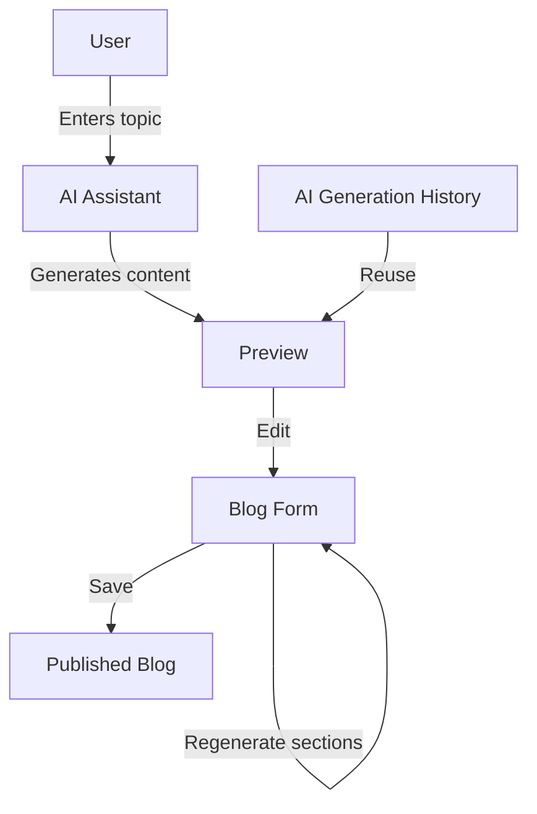
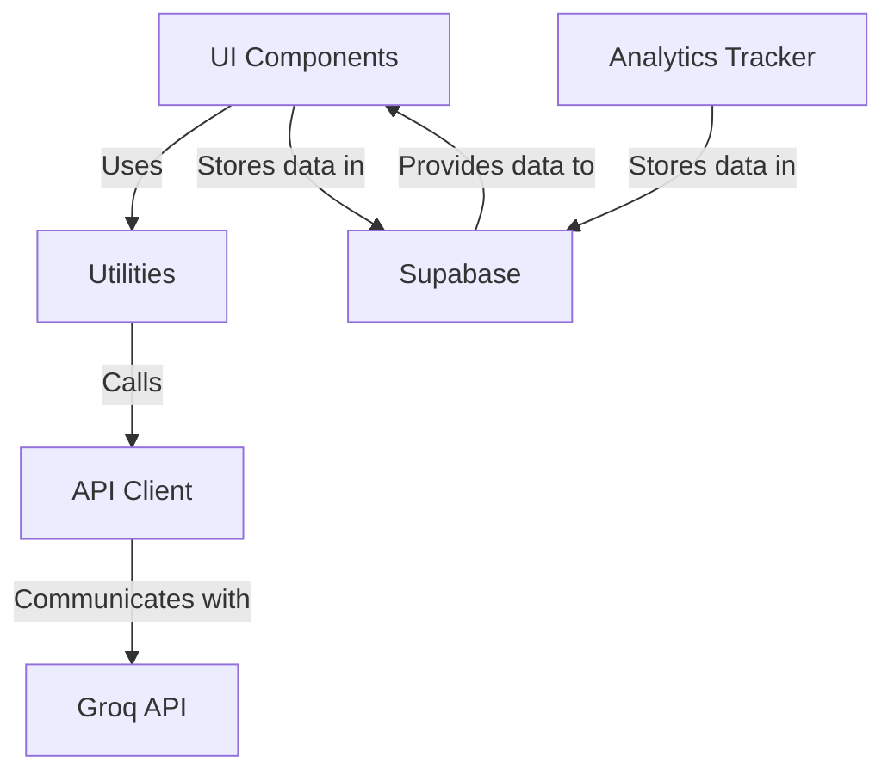
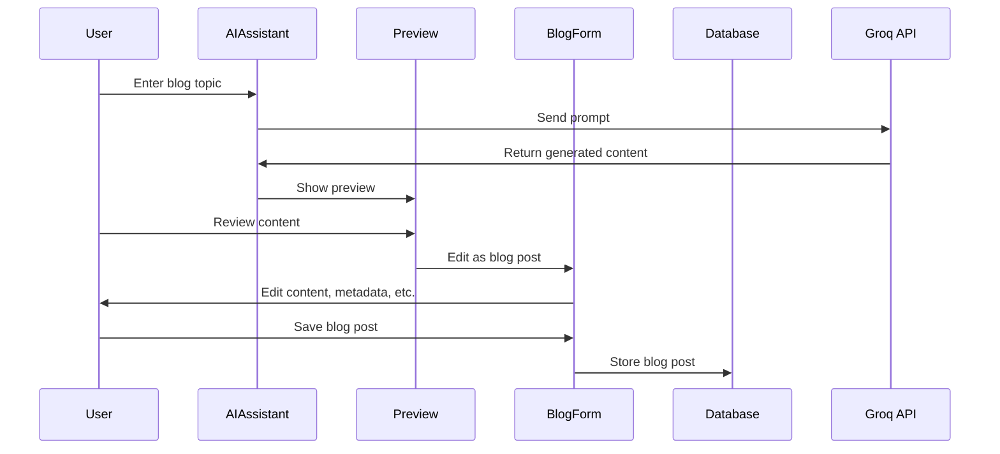
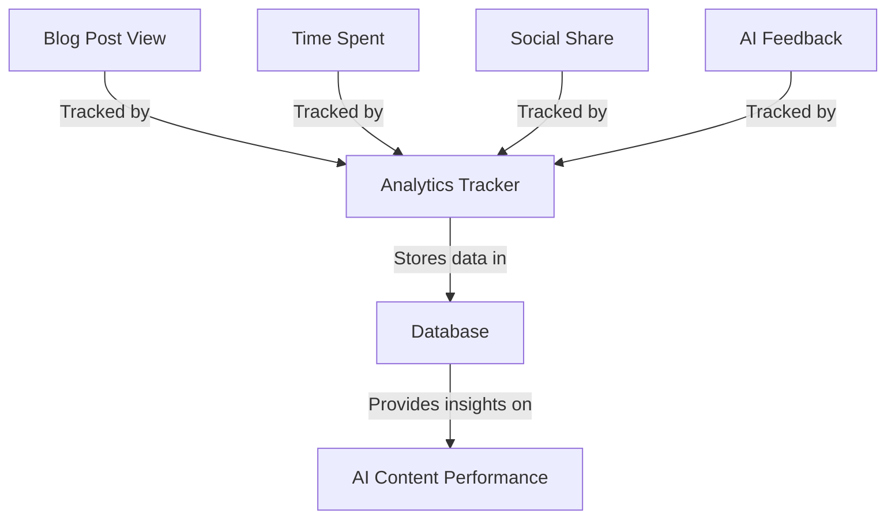
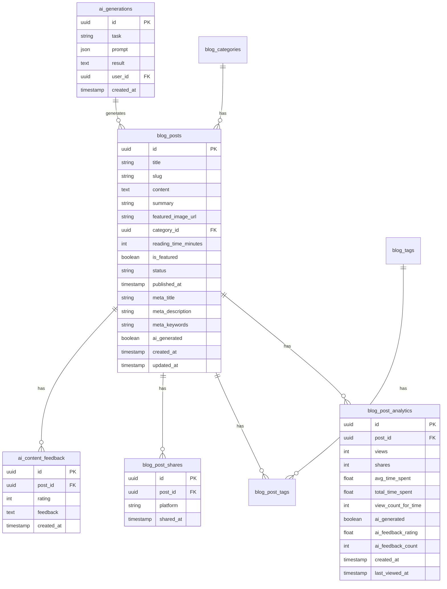
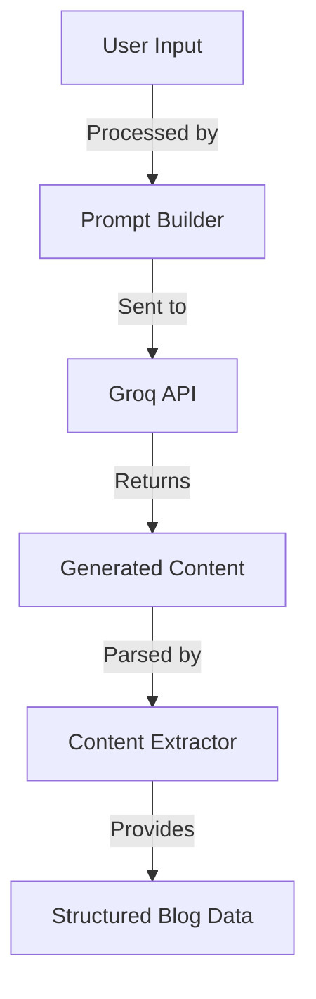
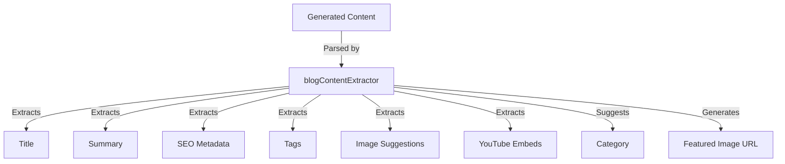
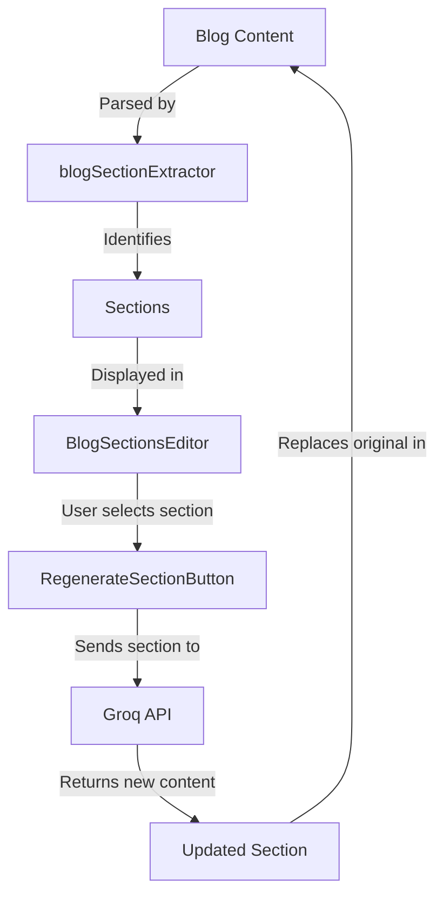
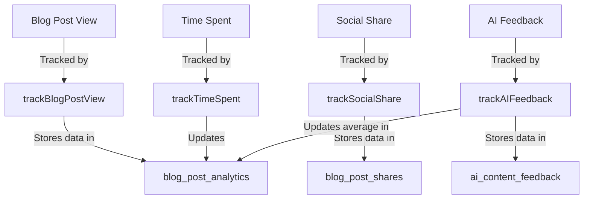

# AI-Powered Blog Post Creation System

This document provides an overview of the AI-powered blog post creation system implemented in the portfolio application. The system leverages the Groq API to generate high-quality blog content with rich elements and provides a seamless workflow for creating, editing, and publishing blog posts.

## Table of Contents

1. [System Overview](#system-overview)
2. [Architecture](#architecture)
3. [Key Components](#key-components)
4. [Workflow](#workflow)
5. [Features](#features)
6. [Analytics and Feedback](#analytics-and-feedback)
7. [Database Schema](#database-schema)
8. [Technical Implementation](#technical-implementation)

## System Overview

The AI-powered blog post creation system allows users to generate complete, publication-ready blog posts with all required metadata, rich content elements, and proper formatting. The system uses the Groq API to generate content and provides a seamless workflow for editing and publishing the generated content.

## Architecture

The system follows a modular architecture with clear separation of concerns:

## Key Components

### UI Components

1. **AIPage**: Main page for generating AI content
2. **SaveToBlogButton**: Button for saving AI content as a blog post
3. **BlogPreviewModal**: Modal for previewing blog content before saving
4. **AIGeneratedBadge**: Visual indicator for AI-generated content
5. **BlogSectionsEditor**: Component for displaying and managing blog sections
6. **RegenerateSectionButton**: Button for regenerating specific sections
7. **AIGenerationHistory**: Component for displaying and reusing previous generations
8. **AIFeedbackForm**: Form for collecting feedback on AI-generated content

### Utilities

1. **blogContentExtractor**: Utility for parsing AI-generated content
2. **blogSectionExtractor**: Utility for identifying and manipulating blog sections
3. **analyticsTracker**: Utility for tracking blog post analytics

### API Client

1. **groqAPI**: Client for communicating with the Groq API

## Workflow

The workflow for creating an AI-generated blog post is as follows:

## Features

### 1. Complete Form Auto-Population

- Title, slug, summary
- Full content with proper formatting
- Category selection based on content analysis
- Tag suggestions based on content
- SEO metadata (meta title, description, keywords)
- Reading time calculation
- Featured image suggestions

### 2. Rich Content Generation

- Code blocks with syntax highlighting
- Image placeholders with alt text
- YouTube video embeds
- Blockquotes and callouts
- Tables for data presentation
- Headers and proper content structure

### 3. Seamless Workflow

- One-click transfer from AI Assistant to Blog Form
- Preview capability before transferring to Blog Form
- Regenerate specific sections
- Save AI generation history for future reference

### 4. Admin Control & Customization

- Full editing capabilities in the Blog Form
- Visual indicators for AI-generated content
- Toggle between AI suggestions and manual input
- Request AI improvements on specific sections

## Analytics and Feedback

The system includes comprehensive analytics tracking and feedback collection:

### Analytics Features

1. **View Tracking**: Track views of AI-generated vs. manually created posts
2. **Time Tracking**: Track time spent on posts
3. **Share Tracking**: Track social shares
4. **Feedback Collection**: Collect ratings and feedback on AI-generated content

## Database Schema

The system uses the following database tables:

## Technical Implementation

### 1. Content Generation

The system uses the Groq API to generate blog content. The API is called with a structured prompt that includes guidelines for generating rich content with proper formatting.

### 2. Content Extraction

The generated content is parsed by the `blogContentExtractor` utility to extract structured data:

### 3. Section Regeneration

The system allows regenerating specific sections of the blog post:

### 4. Analytics Tracking

The system tracks various metrics for blog posts:

## Conclusion

The AI-powered blog post creation system provides a comprehensive solution for generating high-quality blog content with minimal effort. The system leverages the power of AI to handle the heavy lifting of content creation while still giving users full control over the final output. The seamless workflow, rich content generation, and comprehensive analytics make it a powerful tool for content creators.
