# Blog System Documentation

This document provides comprehensive documentation for the blog system implemented in the Modern Portfolio application. The system includes content management, publishing, analytics, and AI-assisted features.

## Table of Contents

1. [System Architecture](#system-architecture)
2. [Database Schema](#database-schema)
3. [Content Management](#content-management)
4. [Blog Analytics](#blog-analytics)
5. [AI Integration](#ai-integration)
6. [Social Engagement Features](#social-engagement-features)
7. [Frontend Components](#frontend-components)
8. [API Endpoints](#api-endpoints)
9. [User Flows](#user-flows)
10. [Performance Considerations](#performance-considerations)
11. [Security Considerations](#security-considerations)

## System Architecture

The blog system follows a modern architecture pattern with a React frontend, Supabase backend, and integration with Groq API for AI capabilities.

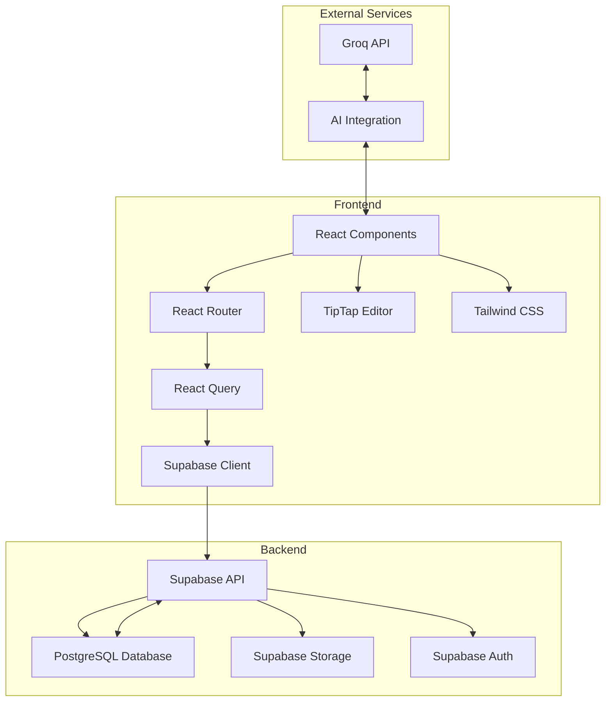

## Database Schema

The blog system uses several tables in the Supabase PostgreSQL database to store and manage content and analytics data.

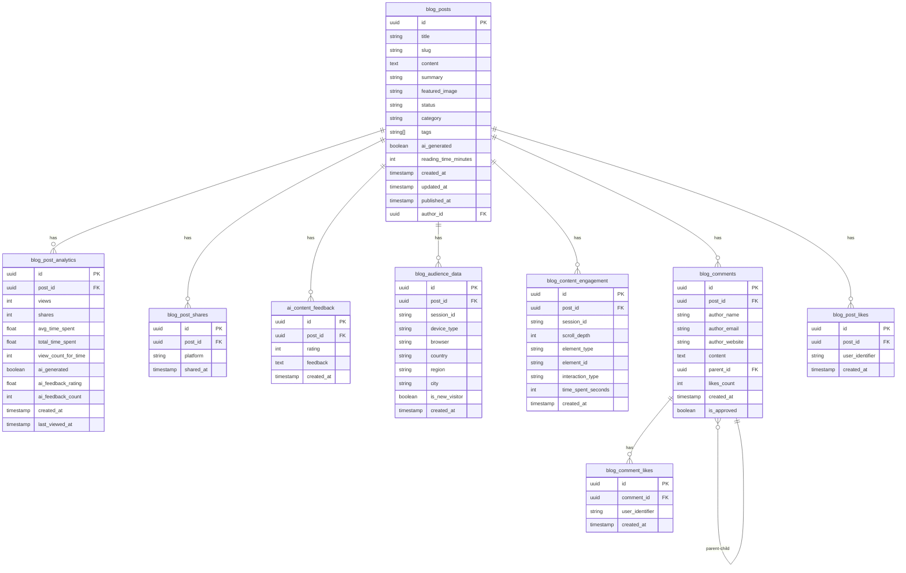

## Content Management

The blog content management system allows administrators to create, edit, and publish blog posts with a rich text editor, media management, and AI-assisted content creation.

### Blog Post Creation Flow

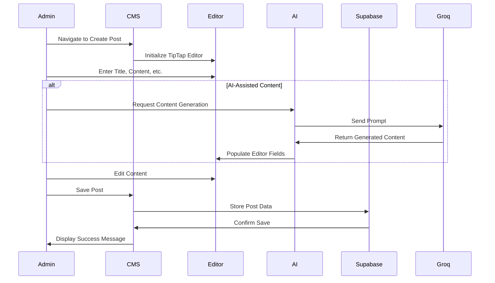

### Media Management

The blog system includes a media library for managing images and other media files used in blog posts.

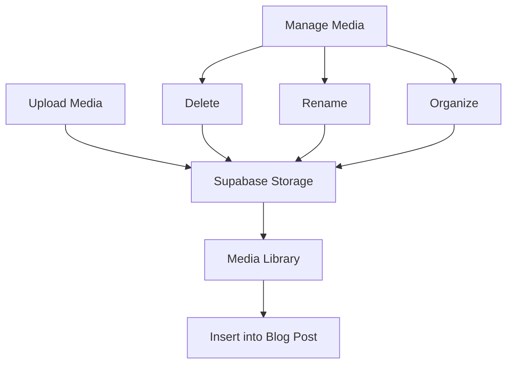

## Blog Analytics

The blog analytics system provides comprehensive insights into blog performance, audience demographics, and content engagement.

### Analytics Data Flow

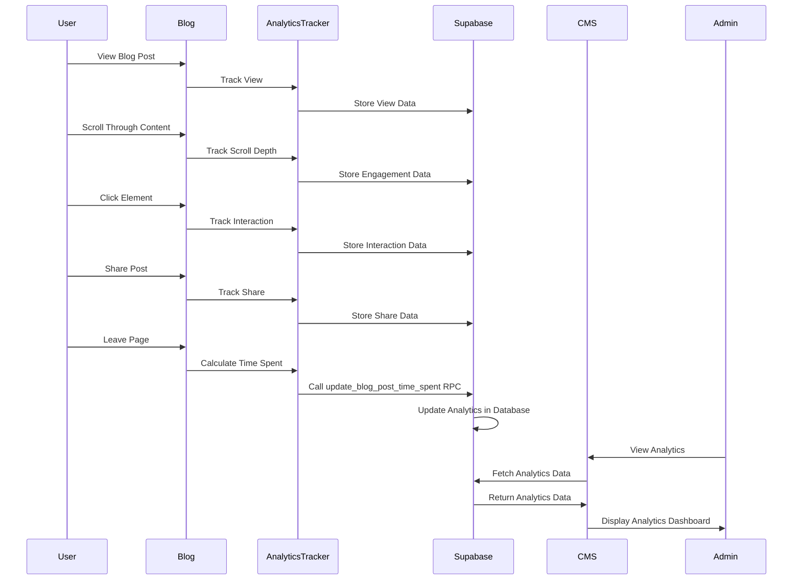

### Analytics Components

The analytics system includes several components for visualizing and analyzing blog performance data.

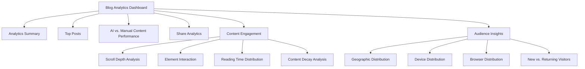

## AI Integration

The blog system integrates with the Groq API to provide AI-assisted content creation and analytics.

### AI Content Generation

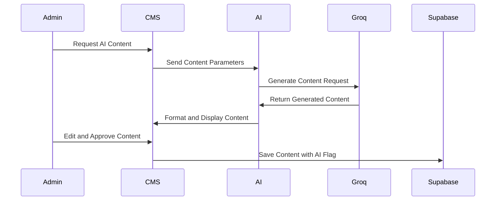

### AI Content Performance Analysis

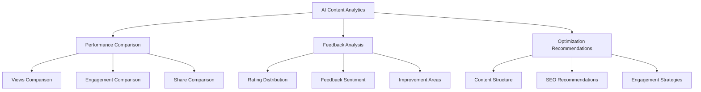

## Social Engagement Features

The blog system includes comprehensive social engagement features to increase user interaction and build community around the content.

### Comments System

The comments system allows readers to engage with blog content through threaded discussions:

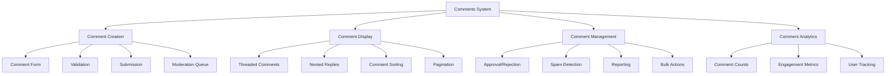

#### Threaded Comments Implementation

The system implements a hierarchical comment structure with parent-child relationships:

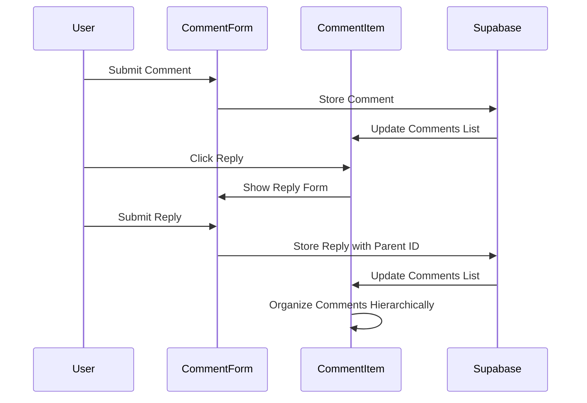

### Like and Reaction System

The like and reaction system allows users to express appreciation for posts and comments:

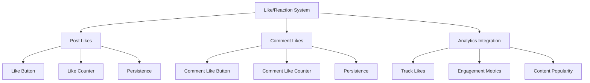

#### Like System Implementation

The like system uses local storage and database persistence to track user interactions:

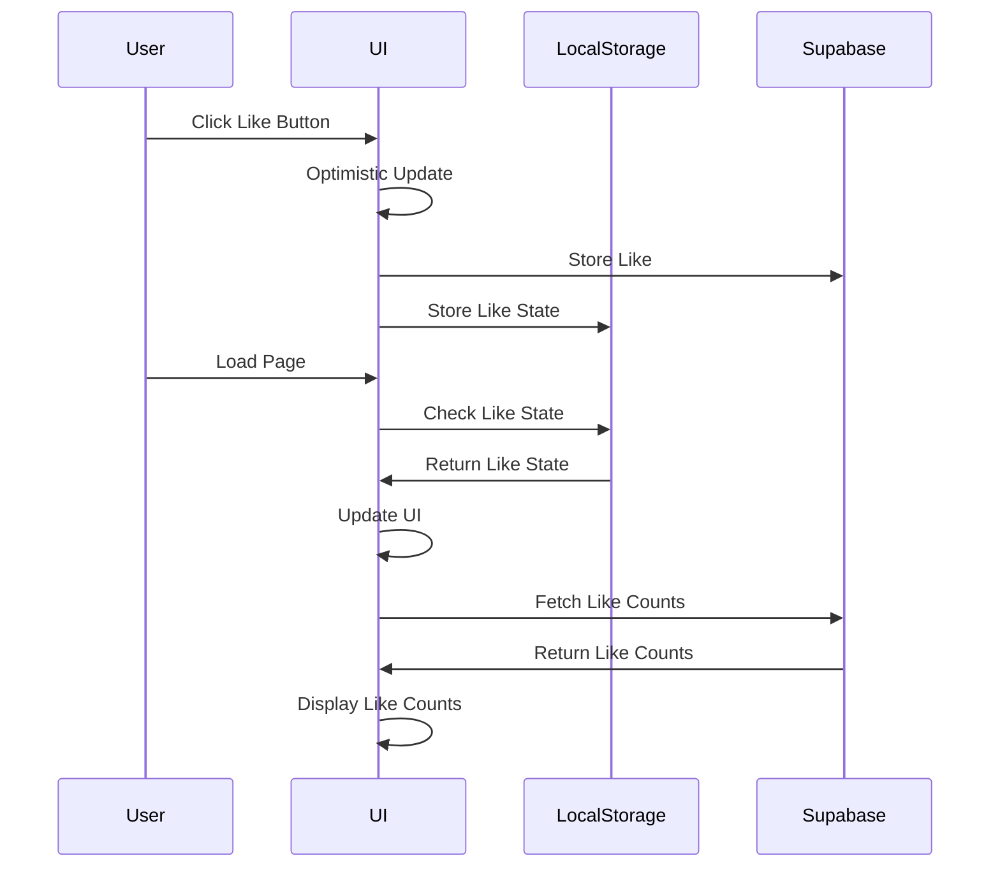

### Share Functionality

The share functionality allows users to share blog posts on various platforms:

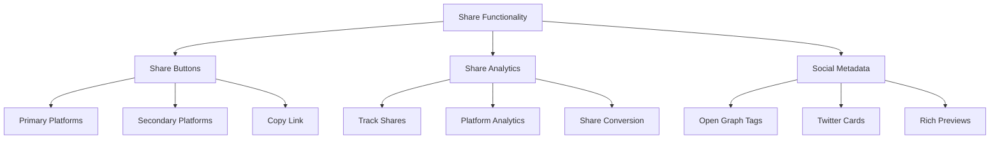

## Frontend Components

The blog system includes a variety of frontend components for both the public-facing blog and the admin CMS.

### Public Blog Components

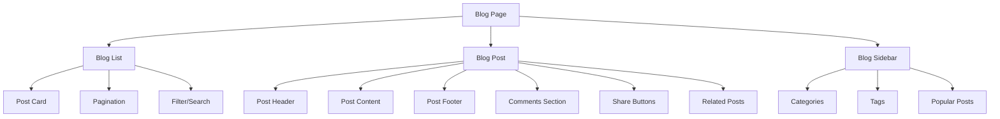

### CMS Blog Components

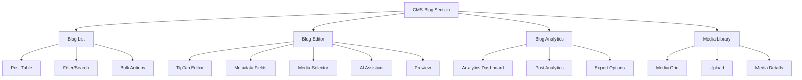

## API Endpoints

The blog system uses Supabase API endpoints for data management and retrieval.

### Blog Post Endpoints

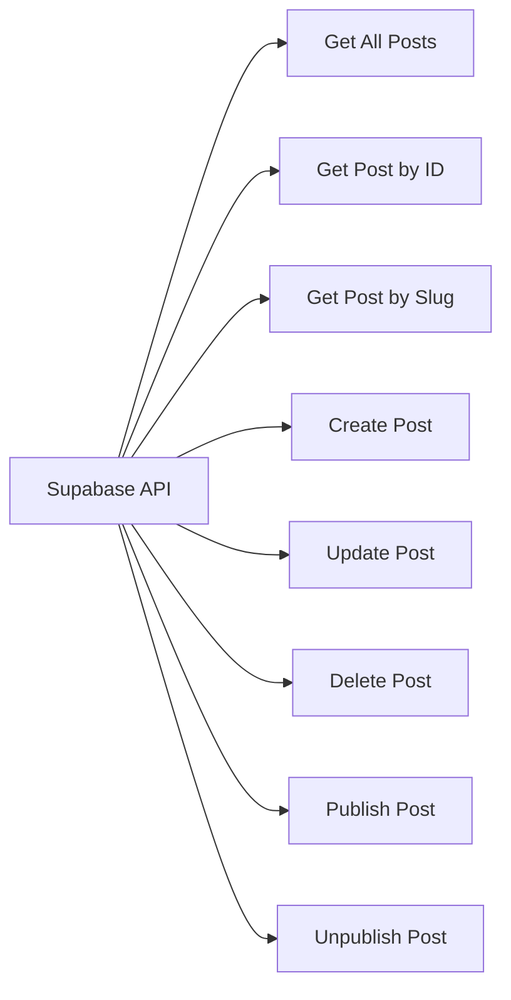

### Blog Analytics Endpoints

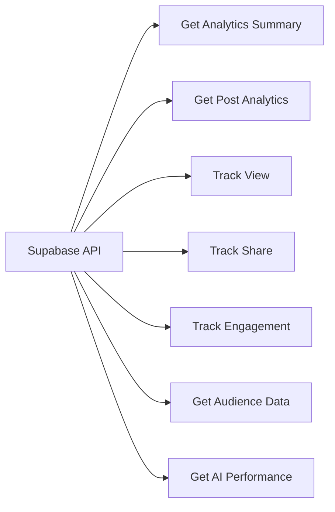

### Blog Comments and Social Endpoints

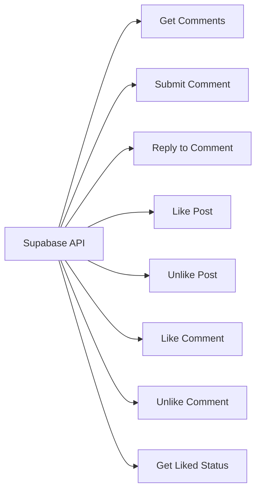

## User Flows

### Blog Reader Flow

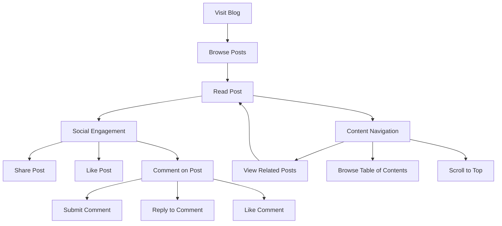

### Blog Admin Flow

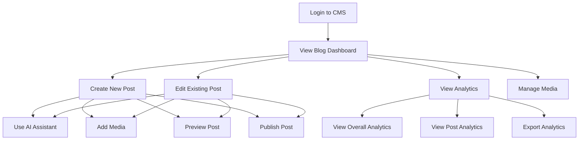

## Performance Considerations

The blog system is designed with performance in mind, implementing several optimizations:

1. **Data Fetching**: Uses React Query for efficient data fetching, caching, and state management.
2. **Image Optimization**: Implements lazy loading and responsive images for better performance.
3. **Code Splitting**: Uses dynamic imports to split code and reduce initial load time.
4. **Pagination**: Implements pagination for blog lists to reduce data transfer and improve load times.
5. **Caching**: Uses browser caching and Supabase caching for improved performance.

```mermaid
graph TD
    A[Performance Optimizations] --> B[Frontend Optimizations]
    A --> C[Backend Optimizations]

    B --> D[Code Splitting]
    B --> E[Lazy Loading]
    B --> F[Responsive Images]
    B --> G[Pagination]

    C --> H[Database Indexing]
    C --> I[Query Optimization]
    C --> J[Caching]
    C --> K[Rate Limiting]
```

## Security Considerations

The blog system implements several security measures to protect data and prevent unauthorized access:

1. **Authentication**: Uses Supabase Auth for secure user authentication.
2. **Authorization**: Implements role-based access control for CMS features.
3. **Input Validation**: Validates all user inputs to prevent injection attacks.
4. **CSRF Protection**: Implements CSRF tokens to prevent cross-site request forgery.
5. **Content Security Policy**: Implements CSP to prevent XSS attacks.
6. **RPC Security**: Implements proper security contexts for RPC functions using SECURITY INVOKER to respect row-level security policies.

### RPC Security Implementation

```mermaid
flowchart TD
    A[Client Request] --> B{Authentication}
    B -->|Authenticated| C{Authorization}
    B -->|Not Authenticated| D[Reject Request]
    C -->|Authorized| E[Execute RPC Function]
    C -->|Not Authorized| F[Reject Request]
    E --> G{Security Context}
    G -->|SECURITY INVOKER| H[Run as Calling User]
    G -->|SECURITY DEFINER| I[Run as Function Owner]
    H --> J[Apply RLS Policies]
    I --> K[Bypass RLS Policies]
    J --> L[Return Results]
    K --> L
```

```mermaid
graph TD
    A[Security Measures] --> B[Authentication]
    A --> C[Authorization]
    A --> D[Data Validation]
    A --> E[Protection Mechanisms]

    B --> F[Supabase Auth]
    B --> G[JWT Tokens]

    C --> H[Role-Based Access]
    C --> I[Permission Checks]

    D --> J[Input Validation]
    D --> K[Output Sanitization]

    E --> L[CSRF Protection]
    E --> M[Content Security Policy]
    E --> N[Rate Limiting]
```

## Blog Analytics Implementation Details

The blog analytics system provides comprehensive insights into blog performance, audience demographics, and content engagement. This section details the implementation of the analytics system.

### Analytics Data Collection

The system collects various types of analytics data through several mechanisms:

1. **Page Views**: Tracked when users load a blog post page
2. **Time Spent**: Calculated based on the time between page load and unload events
3. **Scroll Depth**: Measured as users scroll through content
4. **Element Interactions**: Tracked when users interact with specific elements
5. **Shares**: Recorded when users share content on social platforms
6. **Device and Browser Information**: Collected from user agent data
7. **Geographic Information**: Derived from IP addresses (when available)

### RPC Functions for Analytics

The system uses Remote Procedure Calls (RPCs) to efficiently update analytics data in the database. For example, the `update_blog_post_time_spent` RPC function:

```sql
CREATE OR REPLACE FUNCTION portfolio.update_blog_post_time_spent(post_id UUID, time_spent INTEGER)
RETURNS VOID AS $$
BEGIN
  -- Check if analytics record exists for this post
  IF EXISTS (SELECT 1 FROM portfolio.blog_post_analytics WHERE post_id = $1) THEN
    -- Update existing record
    UPDATE portfolio.blog_post_analytics
    SET
      total_time_spent = total_time_spent + $2,
      view_count_for_time = view_count_for_time + 1,
      avg_time_spent = (total_time_spent + $2) / (view_count_for_time + 1)
    WHERE post_id = $1;
  ELSE
    -- Create new record
    INSERT INTO portfolio.blog_post_analytics (
      post_id,
      avg_time_spent,
      total_time_spent,
      view_count_for_time,
      views
    )
    VALUES (
      $1,
      $2,
      $2,
      1,
      1
    );
  END IF;
END;
$$ LANGUAGE plpgsql;
```

This function is called from the client when a user leaves a blog post page, sending the total time spent reading the post.

```mermaid
sequenceDiagram
    participant User
    participant Blog
    participant AnalyticsTracker
    participant Supabase

    User->>Blog: Load Blog Post
    Blog->>AnalyticsTracker: Initialize Tracking
    AnalyticsTracker->>Supabase: Record Page View

    User->>Blog: Scroll Through Content
    Blog->>AnalyticsTracker: Track Scroll Position
    AnalyticsTracker->>Supabase: Record Scroll Depth

    User->>Blog: Click on Element
    Blog->>AnalyticsTracker: Track Element Interaction
    AnalyticsTracker->>Supabase: Record Interaction

    User->>Blog: Share Post
    Blog->>AnalyticsTracker: Track Share
    AnalyticsTracker->>Supabase: Record Share

    User->>Blog: Leave Page
    Blog->>AnalyticsTracker: Calculate Time Spent
    AnalyticsTracker->>Supabase: Record Time Spent
```

### Analytics Dashboard Components

The analytics dashboard is composed of several components that visualize different aspects of blog performance:

```mermaid
graph TD
    A[Blog Analytics Dashboard] --> B[BlogAnalyticsSummary]
    A --> C[TopBlogPosts]
    A --> D[AIContentPerformance]
    A --> E[BlogShareAnalytics]
    A --> F[BlogContentEngagement]
    A --> G[BlogAudienceInsights]

    B --> B1[Summary Metrics]

    C --> C1[Posts by Views]
    C --> C2[Posts by Time Spent]

    D --> D1[AI vs. Manual Performance]
    D --> D2[Performance Metrics]

    E --> E1[Share Distribution]
    E --> E2[Platform Breakdown]

    F --> F1[ScrollDepthChart]
    F --> F2[ElementInteractionChart]
    F --> F3[ReadingTimeDistribution]
    F --> F4[ContentOptimizationTips]

    G --> G1[AudienceDemographics]
    G --> G2[DeviceDistribution]
    G --> G3[GeographicDistribution]
    G --> G4[BrowserDistribution]
```

### Post-Level Analytics

For individual blog posts, the system provides detailed analytics:

```mermaid
graph TD
    A[BlogPostAnalyticsDetail] --> B[Post Header]
    A --> C[Analytics Tabs]

    C --> D[Overview Tab]
    C --> E[Engagement Tab]
    C --> F[Audience Tab]
    C --> G[Optimization Tab]

    D --> D1[Basic Metrics]
    D --> D2[Share Breakdown]
    D --> D3[AI Feedback]

    E --> E1[PostEngagementMetrics]

    F --> F1[PostAudienceInsights]

    G --> G1[PostOptimizationTips]

    E1 --> E1a[Engagement Metrics Summary]
    E1 --> E1b[Scroll Depth Chart]
    E1 --> E1c[Element Interaction Chart]
    E1 --> E1d[Reading Time Distribution]

    F1 --> F1a[Audience Demographics]
    F1 --> F1b[Device Distribution]
    F1 --> F1c[Geographic Distribution]
    F1 --> F1d[Browser Distribution]

    G1 --> G1a[Content Structure Tips]
    G1 --> G1b[Engagement Tips]
    G1 --> G1c[Device Optimization Tips]
```

### Analytics Data Processing

The system processes raw analytics data to generate insights:

```mermaid
graph TD
    A[Raw Analytics Data] --> B[Data Aggregation]
    B --> C[Metric Calculation]
    C --> D[Insight Generation]
    D --> E[Visualization]

    B --> B1[Group by Post]
    B --> B2[Group by Time Period]
    B --> B3[Group by Device]
    B --> B4[Group by Location]

    C --> C1[Calculate Views]
    C --> C2[Calculate Avg Time]
    C --> C3[Calculate Scroll Depth]
    C --> C4[Calculate Interaction Rate]

    D --> D1[Identify Top Posts]
    D --> D2[Compare AI vs Manual]
    D --> D3[Analyze Audience]
    D --> D4[Generate Recommendations]
```

### Analytics Export Options

The system provides options to export analytics data:

```mermaid
graph TD
    A[AnalyticsExportOptions] --> B[Print Report]
    A --> C[Export CSV]
    A --> D[Export PDF]
    A --> E[Email Report]

    B --> F[Browser Print]

    C --> G[Generate CSV]
    C --> H[Download File]

    D --> I[Generate PDF]
    D --> J[Download File]

    E --> K[Generate Report]
    E --> L[Send Email]
```

## Troubleshooting

### Common Issues

#### Relationship Ambiguity Error

If you encounter the error "Could not embed because more than one relationship was found for 'blog_audience_data' and 'post_id'", this indicates duplicate foreign key relationships in the database schema.

**Solution**:

1. Run the migration file `20240702000002_recreate_blog_analytics_tables.sql` to recreate the tables with proper relationships.
2. Use explicit column selection in queries instead of `select('*')` to avoid ambiguity.

```mermaid
flowchart TD
    A[Error: Multiple relationships found] --> B{Fix Approach}
    B -->|Database Schema Fix| C[Run recreate_blog_analytics_tables migration]
    B -->|Query Fix| D[Use explicit column selection]
    C --> E[Drop duplicate constraints]
    C --> F[Recreate tables with single FK]
    D --> G["Replace select * with explicit columns"]
    E --> H[Issue Resolved]
    F --> H
    G --> H
```

#### RPC Function Not Found

If you encounter a 404 error when calling an RPC function, the function may not be properly defined in the database.

**Solution**:

1. Check that the migration file defining the function has been applied.
2. Verify the function name and parameters match exactly.
3. Implement a fallback approach in your code to handle cases where the RPC function might not be available.

```mermaid
flowchart TD
    A[Error: 404 RPC Function Not Found] --> B{Troubleshooting Steps}
    B -->|Check Migrations| C[Verify migration was applied]
    B -->|Check Function Name| D[Ensure exact name match]
    B -->|Check Parameters| E[Verify parameter types]
    B -->|Implement Fallback| F[Add fallback logic]
    C --> G[Run missing migrations]
    D --> H[Fix function name]
    E --> I[Fix parameter types]
    F --> J[Create fallback implementation]
    G --> K[Issue Resolved]
    H --> K
    I --> K
    J --> K
```

For more information on RPC functions, see the [RPC Functions Documentation](./supabase/rpc_functions.md).

## Conclusion

This documentation provides a comprehensive overview of the blog system implemented in the Modern Portfolio application. The system includes content management, publishing, analytics, and AI-assisted features, all designed to provide a seamless experience for both blog administrators and readers.

The blog system leverages modern technologies and best practices to deliver a high-performance, secure, and feature-rich blogging platform. The integration with Supabase provides a robust backend infrastructure, while the React frontend offers a responsive and intuitive user interface.

The analytics system provides valuable insights into blog performance and user engagement, helping administrators make data-driven decisions to improve content and user experience. The AI-assisted features streamline content creation and enhance the quality of blog posts.

Continuous improvements and updates to the blog system ensure that it remains at the cutting edge of web development and content management technologies.
