# Blog System Documentation

This document provides comprehensive documentation for the blog system implemented in the Modern Portfolio application. The system includes content management, publishing, analytics, and AI-assisted features.

## Table of Contents

1. [System Architecture](#system-architecture)
2. [Database Schema](#database-schema)
3. [Content Management](#content-management)
4. [Blog Analytics](#blog-analytics)
5. [AI Integration](#ai-integration)
6. [Frontend Components](#frontend-components)
7. [API Endpoints](#api-endpoints)
8. [User Flows](#user-flows)
9. [Performance Considerations](#performance-considerations)
10. [Security Considerations](#security-considerations)

## System Architecture

The blog system follows a modern architecture pattern with a React frontend, Supabase backend, and integration with Groq API for AI capabilities.

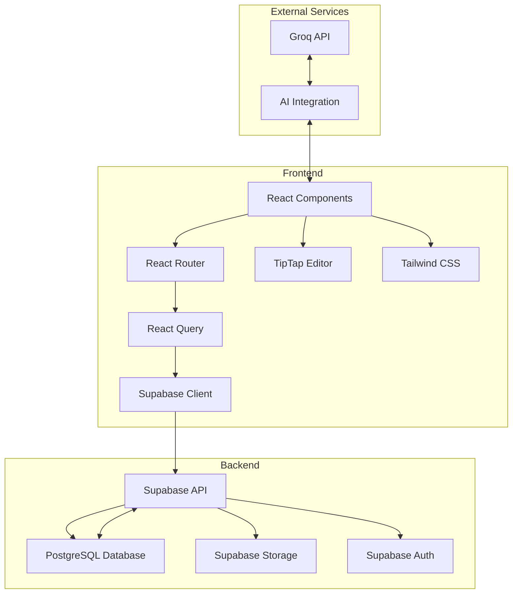

## Database Schema

The blog system uses several tables in the Supabase PostgreSQL database to store and manage content and analytics data.

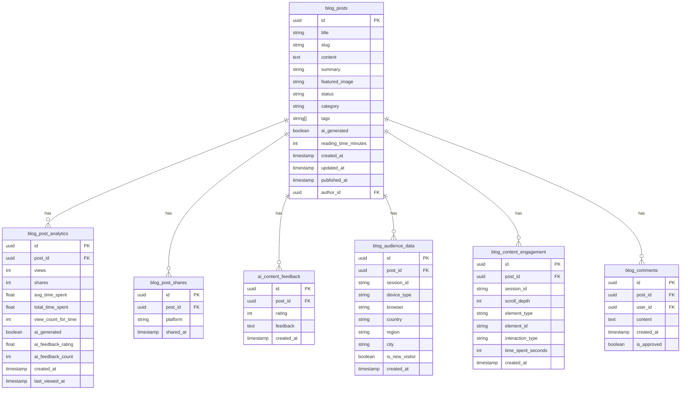

## Content Management

The blog content management system allows administrators to create, edit, and publish blog posts with a rich text editor, media management, and AI-assisted content creation.

### Blog Post Creation Flow

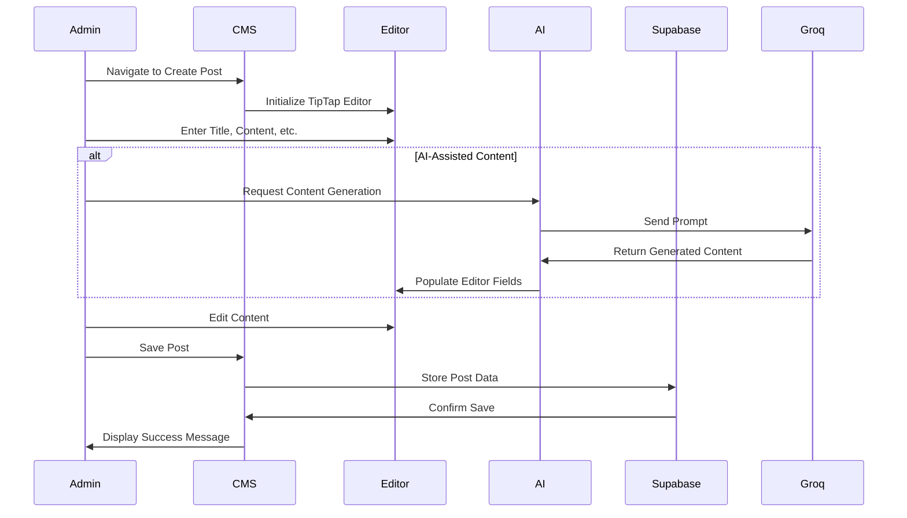

### Media Management

The blog system includes a media library for managing images and other media files used in blog posts.

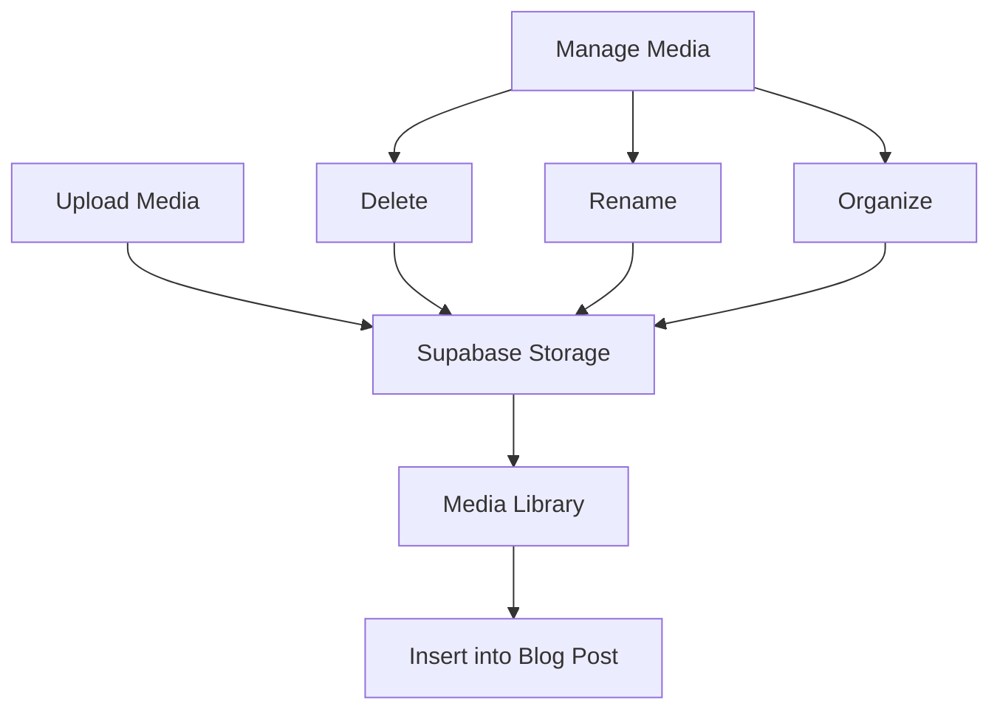

## Blog Analytics

The blog analytics system provides comprehensive insights into blog performance, audience demographics, and content engagement.

### Analytics Data Flow

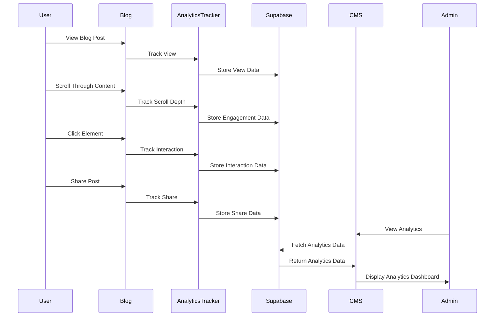

### Analytics Components

The analytics system includes several components for visualizing and analyzing blog performance data.

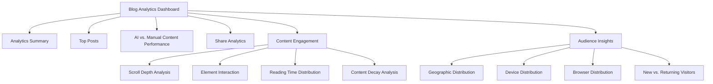

## AI Integration

The blog system integrates with the Groq API to provide AI-assisted content creation and analytics.

### AI Content Generation

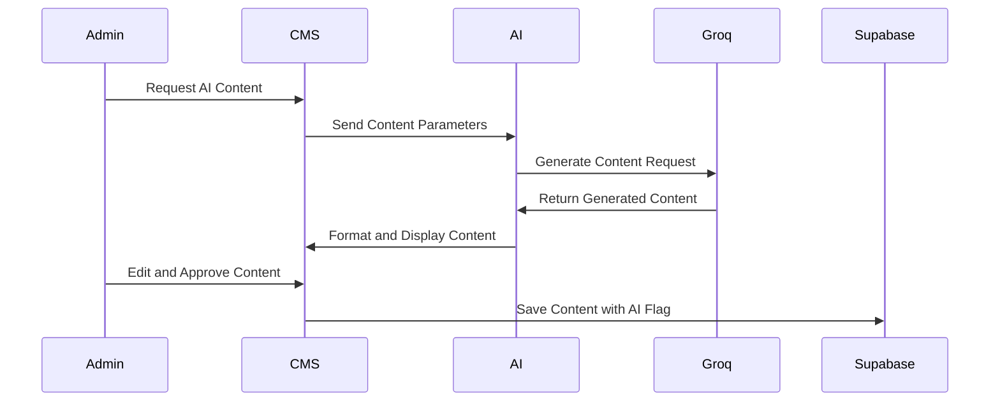

### AI Content Performance Analysis

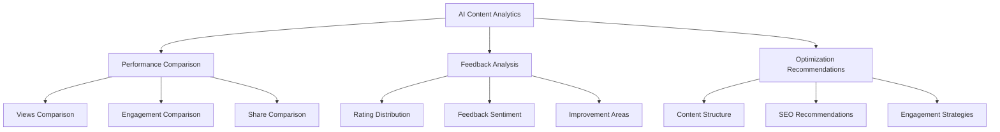

## Frontend Components

The blog system includes a variety of frontend components for both the public-facing blog and the admin CMS.

### Public Blog Components

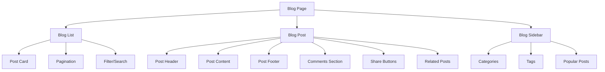

### CMS Blog Components

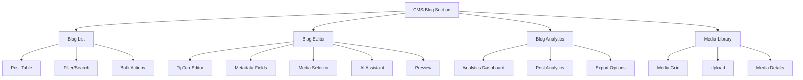

## API Endpoints

The blog system uses Supabase API endpoints for data management and retrieval.

### Blog Post Endpoints

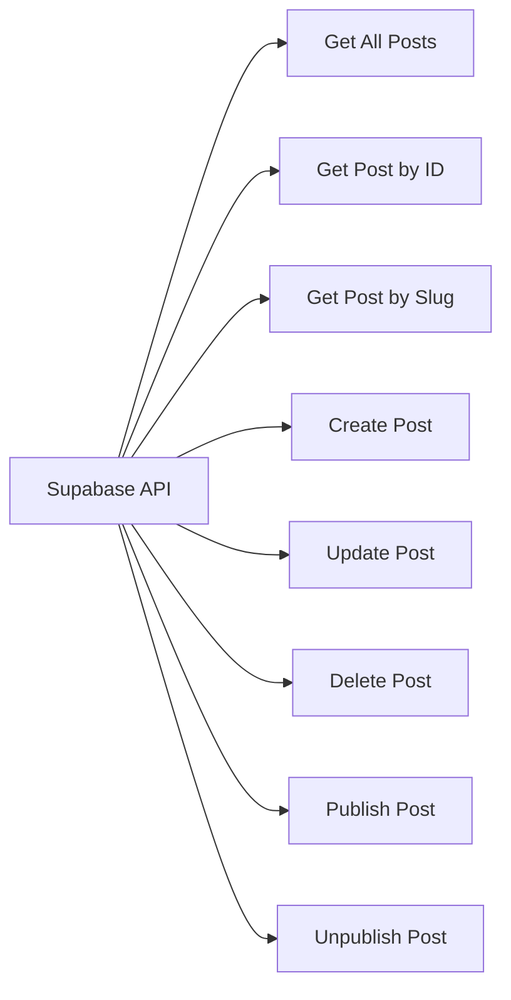

### Blog Analytics Endpoints

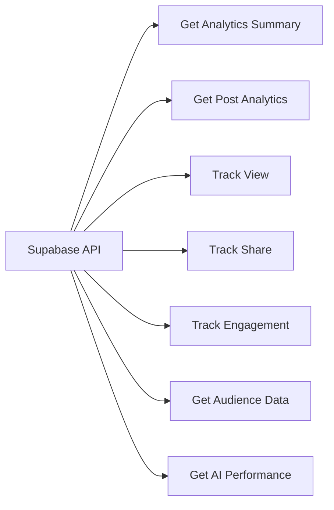

## User Flows

### Blog Reader Flow

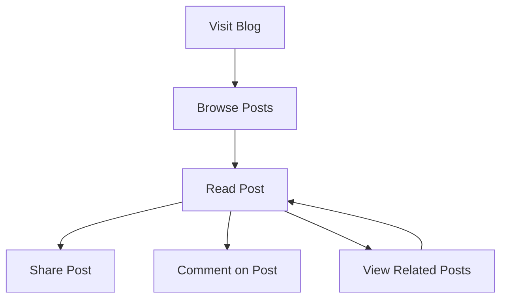

### Blog Admin Flow

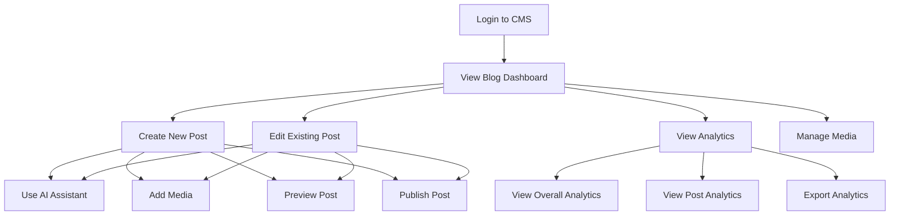

## Performance Considerations

The blog system is designed with performance in mind, implementing several optimizations:

1. **Data Fetching**: Uses React Query for efficient data fetching, caching, and state management.
2. **Image Optimization**: Implements lazy loading and responsive images for better performance.
3. **Code Splitting**: Uses dynamic imports to split code and reduce initial load time.
4. **Pagination**: Implements pagination for blog lists to reduce data transfer and improve load times.
5. **Caching**: Uses browser caching and Supabase caching for improved performance.

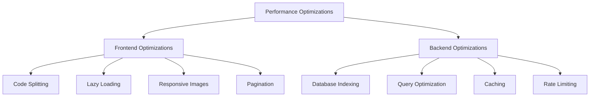

## Security Considerations

The blog system implements several security measures to protect data and prevent unauthorized access:

1. **Authentication**: Uses Supabase Auth for secure user authentication.
2. **Authorization**: Implements role-based access control for CMS features.
3. **Input Validation**: Validates all user inputs to prevent injection attacks.
4. **CSRF Protection**: Implements CSRF tokens to prevent cross-site request forgery.
5. **Content Security Policy**: Implements CSP to prevent XSS attacks.

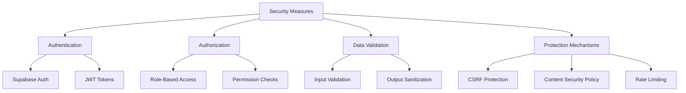

## Blog Analytics Implementation Details

The blog analytics system provides comprehensive insights into blog performance, audience demographics, and content engagement. This section details the implementation of the analytics system.

### Analytics Data Collection

The system collects various types of analytics data:

1. **Page Views**: Tracks when a user views a blog post.
2. **Time Spent**: Measures how long a user spends on a blog post.
3. **Scroll Depth**: Tracks how far a user scrolls down a blog post.
4. **Element Interactions**: Tracks when a user interacts with elements in a blog post (e.g., clicks on links, images, etc.).
5. **Shares**: Tracks when a user shares a blog post on social media.
6. **Device Information**: Collects information about the user's device, browser, and location.

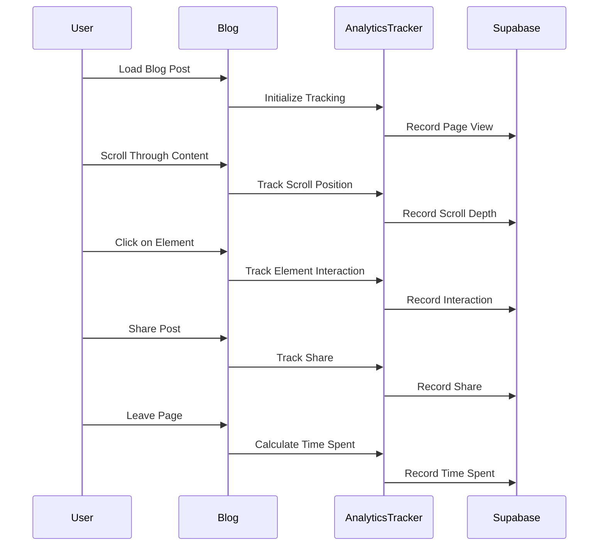

### Analytics Dashboard Components

The analytics dashboard is composed of several components that visualize different aspects of blog performance:

```mermaid
graph TD
    A[Blog Analytics Dashboard] --> B[BlogAnalyticsSummary]
    A --> C[TopBlogPosts]
    A --> D[AIContentPerformance]
    A --> E[BlogShareAnalytics]
    A --> F[BlogContentEngagement]
    A --> G[BlogAudienceInsights]
    
    B --> B1[Summary Metrics]
    
    C --> C1[Posts by Views]
    C --> C2[Posts by Time Spent]
    
    D --> D1[AI vs. Manual Performance]
    D --> D2[Performance Metrics]
    
    E --> E1[Share Distribution]
    E --> E2[Platform Breakdown]
    
    F --> F1[ScrollDepthChart]
    F --> F2[ElementInteractionChart]
    F --> F3[ReadingTimeDistribution]
    F --> F4[ContentOptimizationTips]
    
    G --> G1[AudienceDemographics]
    G --> G2[DeviceDistribution]
    G --> G3[GeographicDistribution]
    G --> G4[BrowserDistribution]
```

### Post-Level Analytics

For individual blog posts, the system provides detailed analytics:

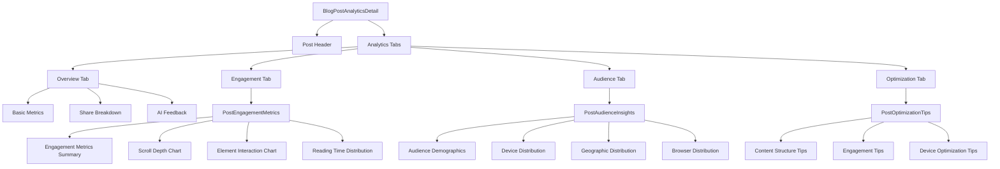

### Analytics Data Processing

The system processes raw analytics data to generate insights:

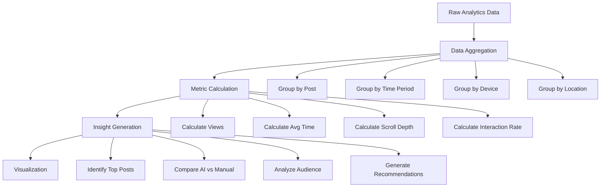

### Analytics Export Options

The system provides options to export analytics data:

```mermaid
graph TD
    A[AnalyticsExportOptions] --> B[Print Report]
    A --> C[Export CSV]
    A --> D[Export PDF]
    A --> E[Email Report]
    
    B --> F[Browser Print]
    
    C --> G[Generate CSV]
    C --> H[Download File]
    
    D --> I[Generate PDF]
    D --> J[Download File]
    
    E --> K[Generate Report]
    E --> L[Send Email]
```

## Conclusion

This documentation provides a comprehensive overview of the blog system implemented in the Modern Portfolio application. The system includes content management, publishing, analytics, and AI-assisted features, all designed to provide a seamless experience for both blog administrators and readers.
