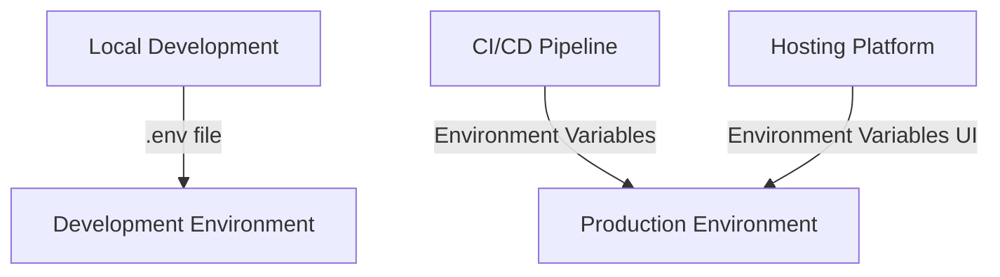
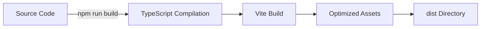

# Deployment Guide for Modern Portfolio

This guide covers the deployment process for the Modern Portfolio application, including different hosting options, environment configuration, and common deployment issues.

## Table of Contents

1. [Deployment Options](#deployment-options)
2. [Environment Configuration](#environment-configuration)
3. [Build Process](#build-process)
4. [Netlify Deployment](#netlify-deployment)
5. [Vercel Deployment](#vercel-deployment)
6. [GitHub Pages Deployment](#github-pages-deployment)
7. [Common Deployment Issues](#common-deployment-issues)
8. [Performance Optimization](#performance-optimization)
9. [Monitoring and Analytics](#monitoring-and-analytics)

## Deployment Options

The Modern Portfolio application can be deployed to various hosting platforms. Here are the recommended options:

### Netlify

**Pros:**
- Easy GitHub integration
- Automatic deployments on push
- Free SSL certificates
- Built-in form handling
- Serverless functions support

**Cons:**
- Limited build minutes on free tier
- Requires configuration for SPA routing (see [Netlify SPA Routing](./netlify-spa-routing.md))

### Vercel

**Pros:**
- Optimized for React applications
- Automatic preview deployments
- Edge network for fast global delivery
- Serverless functions support
- Built-in analytics

**Cons:**
- Limited serverless function execution on free tier

### GitHub Pages

**Pros:**
- Free for public repositories
- Simple setup with GitHub Actions
- Custom domain support

**Cons:**
- No server-side functionality
- Requires additional configuration for SPA routing
- Limited to static content

## Environment Configuration

The application uses environment variables for configuration. Create a `.env` file based on the `.env.example` template:

```
VITE_SUPABASE_URL=your_supabase_url
VITE_SUPABASE_ANON_KEY=your_supabase_anon_key
VITE_GROQ_API_KEY=your_groq_api_key
```

For production deployments, set these environment variables in your hosting platform's dashboard:



## Build Process

The build process compiles the React application into static files that can be served by any web server:

1. **Install dependencies:**
   ```bash
   npm install
   ```

2. **Build the application:**
   ```bash
   npm run build
   ```

3. **Output:**
   The build process creates a `dist` directory containing the compiled application.



## Netlify Deployment

### Automatic Deployment from GitHub

1. Connect your GitHub repository to Netlify
2. Configure build settings:
   - Build command: `npm run build`
   - Publish directory: `dist`
3. Set environment variables in the Netlify dashboard
4. Deploy

### Manual Deployment

1. Build the application locally:
   ```bash
   npm run build
   ```

2. Deploy using Netlify CLI:
   ```bash
   npx netlify deploy --prod --dir=dist
   ```

### SPA Routing Configuration

To handle client-side routing with React Router, configure Netlify to redirect all requests to `index.html`. See [Netlify SPA Routing](./netlify-spa-routing.md) for detailed instructions.

## Vercel Deployment

1. Connect your GitHub repository to Vercel
2. Configure build settings:
   - Framework Preset: Vite
   - Build Command: `npm run build`
   - Output Directory: `dist`
3. Set environment variables in the Vercel dashboard
4. Deploy

Vercel automatically handles SPA routing, so no additional configuration is needed.

## GitHub Pages Deployment

1. Create a GitHub Actions workflow file at `.github/workflows/deploy.yml`:

```yaml
name: Deploy to GitHub Pages

on:
  push:
    branches: [ main ]

jobs:
  build-and-deploy:
    runs-on: ubuntu-latest
    steps:
      - name: Checkout
        uses: actions/checkout@v3

      - name: Setup Node.js
        uses: actions/setup-node@v3
        with:
          node-version: '18'

      - name: Install dependencies
        run: npm ci

      - name: Build
        run: npm run build
        env:
          VITE_SUPABASE_URL: ${{ secrets.VITE_SUPABASE_URL }}
          VITE_SUPABASE_ANON_KEY: ${{ secrets.VITE_SUPABASE_ANON_KEY }}
          VITE_GROQ_API_KEY: ${{ secrets.VITE_GROQ_API_KEY }}

      - name: Create 404.html
        run: cp dist/index.html dist/404.html

      - name: Deploy
        uses: JamesIves/github-pages-deploy-action@v4
        with:
          folder: dist
```

2. Configure GitHub repository settings:
   - Go to Settings > Pages
   - Set source to GitHub Actions

3. Add a `<base>` tag to `index.html` if deploying to a subdirectory:
   ```html
   <base href="/repository-name/">
   ```

4. Create a `404.html` file that redirects to `index.html` to handle SPA routing.

## Common Deployment Issues

### 1. "Page not found" errors on route navigation

**Problem:** When navigating directly to a route or refreshing the page, you get a 404 error.

**Solution:** Configure your hosting platform to handle SPA routing. See [Netlify SPA Routing](./netlify-spa-routing.md).

### 2. Environment variables not available

**Problem:** Environment variables are undefined in the deployed application.

**Solution:** 
- Ensure all environment variables are prefixed with `VITE_` to be included in the client bundle
- Verify environment variables are set in your hosting platform's dashboard
- Check that the variables are referenced correctly in the code

### 3. API requests failing due to CORS

**Problem:** API requests to Supabase or other services fail with CORS errors.

**Solution:**
- Configure CORS settings in your Supabase project
- Use a proxy server or serverless functions for third-party APIs
- Ensure the correct API endpoints are being used

### 4. Assets not loading

**Problem:** Images, fonts, or other assets fail to load in the deployed application.

**Solution:**
- Use relative paths for assets
- Ensure assets are included in the build output
- Check for case-sensitivity issues in file paths

## Performance Optimization

To optimize the performance of your deployed application:

1. **Code Splitting:**
   The application uses dynamic imports for route-based code splitting:
   ```javascript
   const BlogPage = React.lazy(() => import('./pages/BlogPage'));
   ```

2. **Asset Optimization:**
   - Images are optimized during build
   - Fonts are preloaded
   - CSS is minified

3. **Caching Strategy:**
   - Static assets have long cache times
   - API responses are cached with SWR or React Query

4. **Lazy Loading:**
   - Images use the `loading="lazy"` attribute
   - Components not needed for initial render are lazy-loaded

## Monitoring and Analytics

### Application Monitoring

The application includes built-in analytics tracking for:
- Page views
- User interactions
- Performance metrics

Data is stored in Supabase tables and can be viewed in the CMS analytics dashboard.

### Error Tracking

Consider adding error tracking with services like:
- Sentry
- LogRocket
- New Relic

### Performance Monitoring

Use Lighthouse or PageSpeed Insights to regularly check performance metrics:
- First Contentful Paint (FCP)
- Largest Contentful Paint (LCP)
- Cumulative Layout Shift (CLS)
- Time to Interactive (TTI)

## Conclusion

Following this deployment guide will help you successfully deploy the Modern Portfolio application to your preferred hosting platform. For specific issues related to SPA routing on Netlify, refer to the [Netlify SPA Routing](./netlify-spa-routing.md) documentation.
