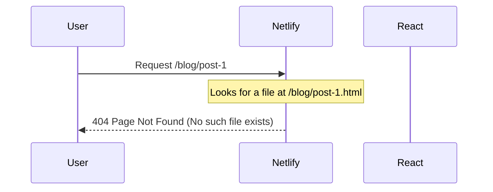
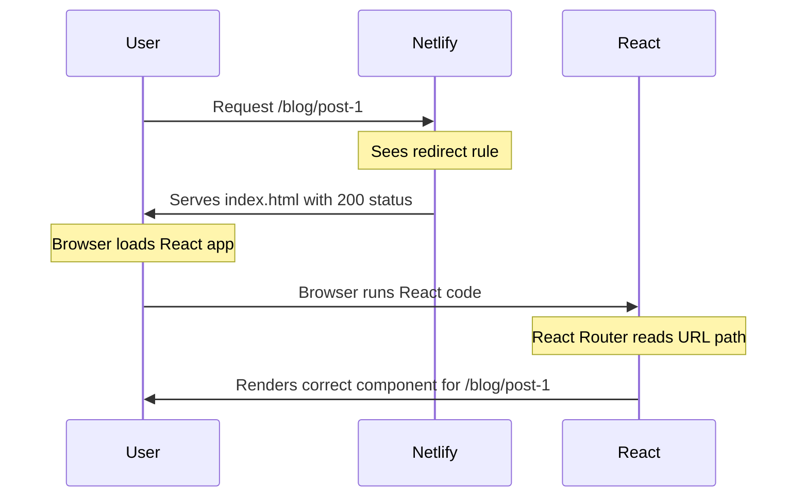

# Handling SPA Routing on Netlify

## Problem: "Page not found" errors on direct URL access or page refresh

When deploying a Single-Page Application (SPA) like our React app to Netlify, you might encounter a "Page not found" error when:

1. Directly accessing a URL (e.g., `https://your-site.netlify.app/blog/post-1`)
2. Refreshing the page on a route other than the root (e.g., refreshing while on `/about`)

This happens because Netlify (like most static hosts) looks for actual files at the requested path. In an SPA, these files don't exist because routing is handled client-side by JavaScript.



## Solution: Configure Netlify redirects

To solve this issue, we need to configure Netlify to serve the main `index.html` file for all routes, allowing our React Router to handle the routing client-side.

There are two ways to configure this:

### Method 1: Using a `_redirects` file

1. Create a file named `_redirects` in the `public` directory with the following content:

```
/* /index.html 200
```

This tells Netlify to redirect all requests (`/*`) to `/index.html` with a 200 (OK) status code.

2. Make sure the `_redirects` file is included in your build output (the `dist` directory).

### Method 2: Using a `netlify.toml` configuration file

Create a `netlify.toml` file in the root of your project:

```toml
[build]
  command = "npm run build"
  publish = "dist"

# Handle SPA routing - redirect all paths to index.html
[[redirects]]
  from = "/*"
  to = "/index.html"
  status = 200
```

## How it works

With the redirect configuration in place, the request flow changes:



## Implementation in our project

We've implemented both methods to ensure maximum compatibility:

1. Created a `_redirects` file in the `public` directory
2. Created a `netlify.toml` file in the root directory
3. Updated the Vite configuration to ensure the `public` directory is properly included in the build output

### Vite Configuration

Our `vite.config.ts` includes the following settings to ensure the `public` directory (including the `_redirects` file) is properly included in the build output:

```typescript
export default defineConfig({
  plugins: [
    react(),
    tailwindcss(),
  ],
  build: {
    rollupOptions: {
      input: {
        main: 'index.html',
      },
    },
  },
  publicDir: 'public',
})
```

## Troubleshooting

If you're still experiencing "Page not found" errors after deploying:

1. **Check your build output**: Ensure the `_redirects` file is present in your `dist` directory after building.

2. **Verify Netlify deployment settings**: In the Netlify dashboard, go to Site settings > Build & deploy > Continuous Deployment and verify:
   - Build command is set to `npm run build`
   - Publish directory is set to `dist`

3. **Force a redeploy**: Sometimes, you may need to trigger a new deployment for the changes to take effect.

4. **Check Netlify logs**: If issues persist, check the deployment logs in the Netlify dashboard for any errors.

## Additional Resources

- [Netlify Redirects Documentation](https://docs.netlify.com/routing/redirects/)
- [React Router Documentation](https://reactrouter.com/en/main)
- [Vite Static Asset Handling](https://vitejs.dev/guide/assets.html)

## Common Patterns for SPA Routing

### Basic Redirect

The simplest solution is what we've implemented:

```
/* /index.html 200
```

### Custom 404 Page

If you want a custom 404 page for truly non-existent routes (that your React Router would also consider invalid):

```
/* /index.html 200
/non-existent-path /404.html 404
```

### API Proxying

If your SPA communicates with an API on a different domain, you can set up proxying:

```
/api/* https://api.example.com/:splat 200
/* /index.html 200
```

This would proxy requests to `/api/users` to `https://api.example.com/users`.

## Conclusion

By implementing proper redirect rules for Netlify, we've ensured that our React SPA handles routing correctly, allowing users to directly access any route and refresh the page without encountering 404 errors.
