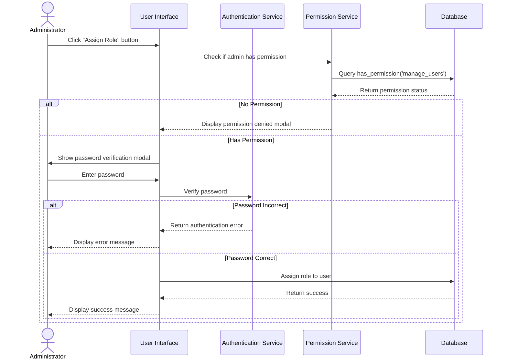

# Role Management System Updates

> **Note**: This document focuses on recent updates to the role management system. For comprehensive information about the entire user management system, please refer to the [User Management System Documentation](./user-management-system.md).

## Table of Contents

1. [Overview](#overview)
2. [New Features](#new-features)
3. [Role Assignment Workflow](#role-assignment-workflow)
4. [Permission Checking](#permission-checking)
5. [Password Verification](#password-verification)
6. [Role Color System](#role-color-system)
7. [Error Handling](#error-handling)
8. [Database Functions](#database-functions)
9. [Implementation Details](#implementation-details)
10. [Best Practices](#best-practices)

## Overview

This document details the recent updates to the role management system, focusing on enhanced security, improved user experience, and more robust error handling. The updates include password verification for role changes, permission checking before role assignment, and a dynamic role color system.

## New Features

### 1. Password Verification for Role Changes

Role assignments now require password verification, adding an extra layer of security to prevent unauthorized role changes.

### 2. Permission Checking

The system now checks if a user has the required permissions before allowing role assignment, providing better security and access control.

### 3. Dynamic Role Color System

Roles now have distinct colors for better visual identification. The system includes predefined colors for common roles and a hash-based algorithm for dynamically assigning colors to new roles.

### 4. Improved Error Handling

The system now provides more user-friendly error messages and handles errors more gracefully, improving the overall user experience.

## Role Assignment Workflow

The updated role assignment process involves multiple security checks:



## Permission Checking

### Implementation

The system uses the `has_permission` function to check if a user has the required permissions before allowing role assignment:

```javascript
// Check if user has permission to manage users
try {
  const { data: hasPermission, error: permissionError } = await supabase
    .rpc('has_permission', { permission_name: 'manage_users' });

  if (permissionError) {
    console.error('Error checking permissions:', permissionError);
    setShowPermissionErrorModal(true);
  } else if (!hasPermission) {
    // User doesn't have permission
    setShowPermissionErrorModal(true);
  } else {
    // User has permission, proceed with password verification
    setSelectedRole({ id: roleId, name: roleName });
    setShowPasswordVerificationModal(true);
  }
} catch (error) {
  console.error('Error checking permissions:', error);
  setShowPermissionErrorModal(true);
}
```

### Permission Denied Modal

When a user doesn't have the required permissions, a clear and user-friendly modal is displayed:

```jsx
<ConfirmModal
  isOpen={showPermissionErrorModal}
  title="Permission Denied"
  message={
    <div className="text-center">
      <div className="mb-4">
        <NoSymbolIcon className="h-12 w-12 text-red-500 mx-auto" />
      </div>
      <p className="mb-2">You do not have permission to assign roles.</p>
      <p className="text-sm text-gray-500 dark:text-gray-400">
        Please contact an administrator if you need this access.
      </p>
    </div>
  }
  confirmLabel="I Understand"
  onConfirm={() => setShowPermissionErrorModal(false)}
  onClose={() => setShowPermissionErrorModal(false)}
  variant="danger"
/>
```

## Password Verification

### Implementation

The system uses Supabase Auth to verify the user's password before allowing role assignment:

```javascript
// First verify the password with Supabase
if (!user?.email) {
  throw new Error('User email not found. Please sign in again.');
}

const { error: signInError } = await supabase.auth.signInWithPassword({
  email: user.email,
  password: password,
});

if (signInError) {
  throw signInError;
}

// If password verification succeeds, call onVerify
const result = await onVerify(password);
```

### Auto-Focus on Password Input

The password verification modal now automatically focuses on the password input field when it appears:

```javascript
// Focus the password input when the modal opens
useEffect(() => {
  if (isOpen && passwordInputRef.current) {
    // Small delay to ensure the modal is fully rendered
    setTimeout(() => {
      passwordInputRef.current?.focus();
    }, 50);
  }
}, [isOpen]);
```

## Role Color System

### Predefined Colors

The system includes predefined colors for common roles:

```javascript
const roleColorMap = new Map<string, BadgeColor>([
  ['admin', 'red'],
  ['editor', 'blue'],
  ['viewer', 'green'],
  ['content_editor', 'indigo'],
  ['author', 'purple'],
  ['moderator', 'yellow'],
  ['analyst', 'pink']
]);
```

### Dynamic Color Assignment

For roles without predefined colors, a hash-based algorithm assigns a consistent color:

```javascript
// Function to generate a consistent color based on role name
const generateColorFromName = (name: string): BadgeColor => {
  // List of available colors (excluding gray which is our default)
  const availableColors: BadgeColor[] = ['blue', 'green', 'indigo', 'purple', 'pink', 'yellow', 'red'];

  // Generate a hash from the role name
  let hash = 0;
  for (let i = 0; i < name.length; i++) {
    hash = ((hash << 5) - hash) + name.charCodeAt(i);
    hash |= 0; // Convert to 32bit integer
  }

  // Use the hash to pick a color from the available colors
  const colorIndex = Math.abs(hash) % availableColors.length;
  return availableColors[colorIndex];
};
```

### Color Application

The system applies the colors to role badges in both the user list and the role dropdown:

```javascript
// Get badge color for a role
const getBadgeColor = (roleName: string): BadgeColor => {
  // If we have a predefined color for this role, use it
  if (roleColorMap.has(roleName)) {
    return roleColorMap.get(roleName)!;
  }

  // Otherwise, generate a color based on the role name
  return generateColorFromName(roleName);
};
```

## Error Handling

### User-Friendly Error Messages

The system now provides more user-friendly error messages:

```javascript
// Provide a more user-friendly error message
if (error instanceof Error) {
  // Check for specific error messages and provide more user-friendly versions
  if (error.message.includes('Invalid login credentials')) {
    setError('Incorrect password. Please try again.');
  } else if (error.message.includes('permission')) {
    setError('You do not have permission to perform this action.');
  } else {
    setError(error.message);
  }
} else {
  setError('Verification failed. Please try again.');
}
```

### Self-Role Change Prevention

The system prevents users from changing their own roles:

```javascript
// Check if this is the current user
const isSelf = currentUser?.id === userId;

// Handle role selection
const handleRoleSelect = async (roleId: string, roleName: string) => {
  if (isSelf) {
    // Show modal instead of proceeding with role change
    setShowSelfRoleChangeModal(true);
  } else {
    // Check if user has permission to manage users
    // ...
  }
};
```

## Database Functions

### has_permission Function

The `has_permission` function checks if a user has a specific permission:

```sql
CREATE OR REPLACE FUNCTION portfolio.has_permission(
    permission_name TEXT,
    in_user_id UUID DEFAULT auth.uid()
) RETURNS BOOLEAN AS $$
DECLARE
    has_perm BOOLEAN;
BEGIN
    -- Check if the user has the permission through any of their roles
    SELECT EXISTS (
        SELECT 1
        FROM portfolio.user_roles ur
        JOIN portfolio.roles r ON ur.role_id = r.id
        WHERE ur.user_id = in_user_id
        AND r.permissions ? permission_name
    ) INTO has_perm;

    -- Return the result
    RETURN has_perm;
END;
$$ LANGUAGE plpgsql SECURITY DEFINER;
```

### assign_role Function

The `assign_role` function assigns a role to a user:

```sql
CREATE OR REPLACE FUNCTION portfolio.assign_role(
    in_user_id UUID,
    in_role_id UUID
) RETURNS JSONB AS $$
DECLARE
    result JSONB;
    role_name TEXT;
BEGIN
    -- Check if the role exists
    SELECT name INTO role_name FROM portfolio.roles WHERE id = in_role_id;

    IF role_name IS NULL THEN
        RAISE EXCEPTION 'Role % does not exist', in_role_id;
    END IF;

    -- Check if the user exists
    IF NOT EXISTS (SELECT 1 FROM auth.users WHERE id = in_user_id) THEN
        RAISE EXCEPTION 'User % does not exist', in_user_id;
    END IF;

    -- Delete existing roles for this user
    DELETE FROM portfolio.user_roles
    WHERE user_id = in_user_id;

    -- Insert the role
    INSERT INTO portfolio.user_roles (user_id, role_id)
    VALUES (in_user_id, in_role_id)
    ON CONFLICT (user_id, role_id) DO NOTHING;

    -- Return success
    result := jsonb_build_object(
        'success', true,
        'user_id', in_user_id,
        'role_id', in_role_id,
        'role_name', role_name
    );

    RETURN result;
END;
$$ LANGUAGE plpgsql SECURITY DEFINER;
```

## Implementation Details

### Role Dropdown Component

The `RoleDropdown` component handles role selection and permission checking:

```jsx
const RoleDropdown: React.FC<RoleDropdownProps> = ({ roles, userId, userEmail, onAssignRole }) => {
  const { user: currentUser } = useCMS();
  const [isOpen, setIsOpen] = useState(false);
  const [showSelfRoleChangeModal, setShowSelfRoleChangeModal] = useState(false);
  const [showPermissionErrorModal, setShowPermissionErrorModal] = useState(false);
  const [selectedRole, setSelectedRole] = useState<{ id: string, name: string } | null>(null);
  const dropdownRef = useRef<HTMLDivElement>(null);

  // Check if this is the current user
  const isSelf = currentUser?.id === userId;

  // Handle role selection
  const handleRoleSelect = async (roleId: string, roleName: string) => {
    if (isSelf) {
      // Show modal instead of proceeding with role change
      setShowSelfRoleChangeModal(true);
    } else {
      // Check if user has permission to manage users
      try {
        const { data: hasPermission, error: permissionError } = await supabase
          .rpc('has_permission', { permission_name: 'manage_users' });

        if (permissionError) {
          console.error('Error checking permissions:', permissionError);
          setShowPermissionErrorModal(true);
        } else if (!hasPermission) {
          // User doesn't have permission
          setShowPermissionErrorModal(true);
        } else {
          // User has permission, proceed with password verification
          setSelectedRole({ id: roleId, name: roleName });
          setShowPasswordVerificationModal(true);
        }
      } catch (error) {
        console.error('Error checking permissions:', error);
        setShowPermissionErrorModal(true);
      }
    }
    setIsOpen(false);
  };
};
```

### Password Verification Modal

The `PasswordVerificationModal` component handles password verification:

```jsx
const PasswordVerificationModal: React.FC<PasswordVerificationModalProps> = ({
  isOpen,
  onClose,
  onVerify,
  title,
  message,
}) => {
  const [password, setPassword] = useState('');
  const [error, setError] = useState<string | null>(null);
  const [isLoading, setIsLoading] = useState(false);
  const [showPassword, setShowPassword] = useState(false);
  const passwordInputRef = useRef<HTMLInputElement>(null);

  const { user } = useCMS();

  // Focus the password input when the modal opens
  useEffect(() => {
    if (isOpen && passwordInputRef.current) {
      // Small delay to ensure the modal is fully rendered
      setTimeout(() => {
        passwordInputRef.current?.focus();
      }, 50);
    }
  }, [isOpen]);

  const handleSubmit = async (e: React.FormEvent) => {
    e.preventDefault();

    if (!password) {
      setError('Password is required');
      return;
    }

    try {
      setIsLoading(true);
      setError(null);

      // First verify the password with Supabase
      if (!user?.email) {
        throw new Error('User email not found. Please sign in again.');
      }

      const { error: signInError } = await supabase.auth.signInWithPassword({
        email: user.email,
        password: password,
      });

      if (signInError) {
        throw signInError;
      }

      // If password verification succeeds, call onVerify
      const result = await onVerify(password);

      // Only reset password and close modal after successful verification
      if (result !== false) {
        setPassword('');
        onClose();
      }
    } catch (error) {
      console.error('Password verification error:', error);
      // Provide a more user-friendly error message
      if (error instanceof Error) {
        // Check for specific error messages and provide more user-friendly versions
        if (error.message.includes('Invalid login credentials')) {
          setError('Incorrect password. Please try again.');
        } else if (error.message.includes('permission')) {
          setError('You do not have permission to perform this action.');
        } else {
          setError(error.message);
        }
      } else {
        setError('Verification failed. Please try again.');
      }
    } finally {
      setIsLoading(false);
    }
  };
};
```

## Best Practices

### Security Best Practices

1. **Always check permissions** before allowing sensitive operations
2. **Verify passwords** for sensitive operations
3. **Prevent users from changing their own roles** to maintain security
4. **Provide clear error messages** for security-related issues
5. **Log all sensitive operations** for audit purposes

### UI Best Practices

1. **Use distinct colors** for different roles to improve visual identification
2. **Auto-focus input fields** in modals for better user experience
3. **Provide clear feedback** for user actions
4. **Handle errors gracefully** with user-friendly messages
5. **Confirm sensitive operations** before executing them
