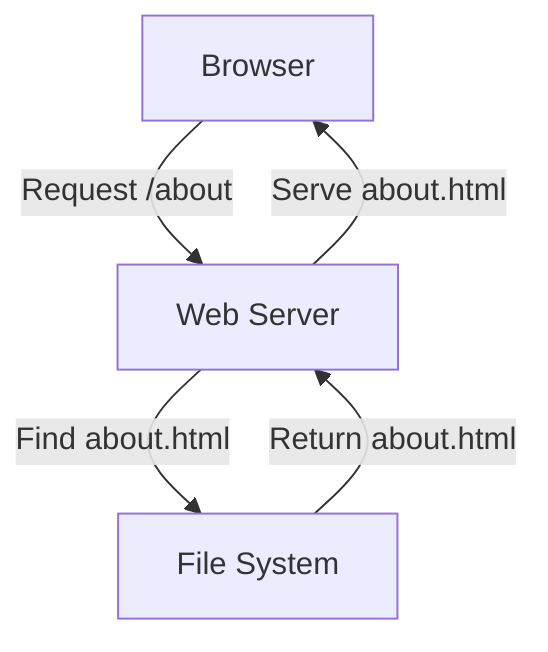
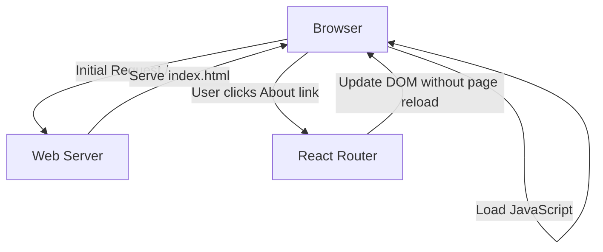
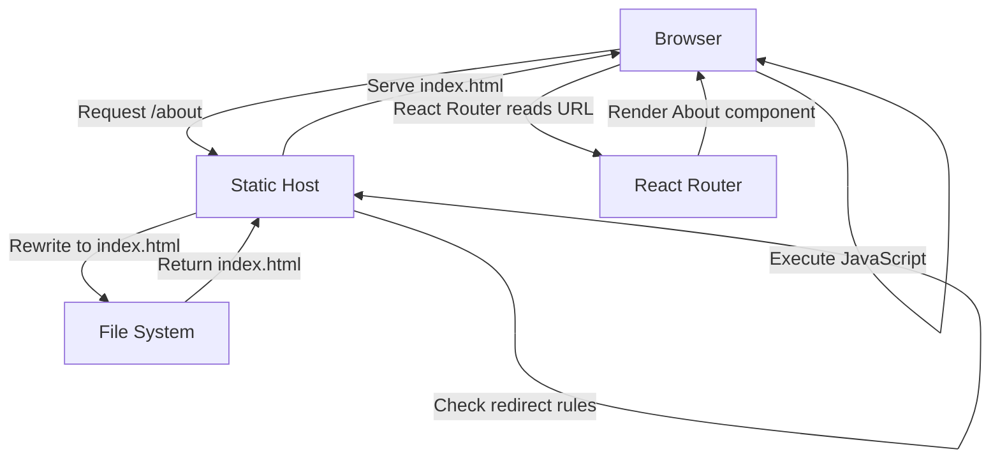

# Understanding SPA Routing and the 404 Problem

This document provides a technical explanation of how routing works in Single-Page Applications (SPAs) like our React portfolio, why 404 errors occur on static hosts like Netlify, and the technical details of various solutions.

## Traditional Web Applications vs. SPAs

### Traditional Multi-Page Applications (MPAs)

In traditional web applications, each URL corresponds to a specific HTML file on the server:



When a user navigates to `/about`, the server looks for an `about.html` file and returns it. Each page transition requires a full page reload.

### Single-Page Applications (SPAs)

In SPAs like our React application, there's only one HTML file (`index.html`), and JavaScript handles the routing client-side:



When a user clicks a link, React Router:
1. Prevents the default browser navigation
2. Updates the URL using the History API
3. Renders the appropriate component based on the new URL
4. Updates the DOM without reloading the page

## The 404 Problem

The problem occurs when a user:
1. Directly accesses a URL (e.g., types `/about` in the address bar)
2. Refreshes the page while on a route other than the root


Since there's no actual `about.html` file on the server (only `index.html`), the server returns a 404 error.

## Technical Solutions

### 1. Server-Side Rewrite/Redirect

The most common solution is to configure the server to rewrite or redirect all requests to `index.html`:



#### Implementation on Different Platforms

**Netlify** (using `_redirects`):
```
/* /index.html 200
```

**Vercel** (using `vercel.json`):
```json
{
  "rewrites": [
    { "source": "/(.*)", "destination": "/index.html" }
  ]
}
```

**Apache** (using `.htaccess`):
```apache
RewriteEngine On
RewriteBase /
RewriteRule ^index\.html$ - [L]
RewriteCond %{REQUEST_FILENAME} !-f
RewriteCond %{REQUEST_FILENAME} !-d
RewriteRule . /index.html [L]
```

**Nginx**:
```nginx
location / {
  try_files $uri $uri/ /index.html;
}
```

### 2. HTML5 History API and `pushState`

The HTML5 History API allows JavaScript to manipulate the browser history without triggering a page reload:

```javascript
// Navigate to /about
window.history.pushState({}, "", "/about");
```

React Router uses this API to update the URL when a user clicks a link. However, this doesn't solve the initial 404 problem when directly accessing a URL.

### 3. Hash-Based Routing

An alternative approach is to use hash-based routing:

```
https://example.com/#/about
```

With hash-based routing:
- The part after the `#` is not sent to the server
- The server always serves `index.html`
- JavaScript reads the hash fragment and renders the appropriate component


While this solves the 404 problem without server configuration, it has drawbacks:
- Less clean URLs
- Poorer SEO (search engines may ignore the hash part)
- Some analytics tools don't track hash changes properly

## Deep Dive: How Our Solution Works

Our solution uses the server-side redirect approach with Netlify. Here's a detailed look at what happens:

1. **User enters `https://example.com/blog/post-1` in browser**

2. **Browser sends request to Netlify:**
   ```
   GET /blog/post-1 HTTP/1.1
   Host: example.com
   ```

3. **Netlify processes request:**
   - Checks for a file at `/blog/post-1.html` (not found)
   - Consults redirect rules in `_redirects` or `netlify.toml`
   - Finds matching rule: `/* /index.html 200`
   - Serves `index.html` with a 200 status code

4. **Browser receives and processes `index.html`:**
   - Loads React application JavaScript
   - React Router initializes and reads the current URL (`/blog/post-1`)
   - Matches the URL to the appropriate route configuration
   - Renders the corresponding component (e.g., `BlogPostPage`)

5. **React application state:**
   - The application behaves as if the user navigated to `/blog/post-1` from within the app
   - All client-side routing functionality works normally
   - The user sees the correct content for the requested URL

## Implementation Details in Our Project

### 1. Netlify Configuration

We've implemented both methods to ensure maximum compatibility:

**Method 1: `_redirects` file in `public` directory:**
```
/* /index.html 200
```

**Method 2: `netlify.toml` in project root:**
```toml
[build]
  command = "npm run build"
  publish = "dist"

[[redirects]]
  from = "/*"
  to = "/index.html"
  status = 200
```

### 2. Vite Configuration

Our `vite.config.ts` ensures the `public` directory (including the `_redirects` file) is included in the build output:

```typescript
export default defineConfig({
  plugins: [
    react(),
    tailwindcss(),
  ],
  build: {
    rollupOptions: {
      input: {
        main: 'index.html',
      },
    },
  },
  publicDir: 'public',
})
```

### 3. React Router Configuration

Our React Router setup uses the browser history API for clean URLs:

```typescript
import { BrowserRouter as Router, Routes, Route } from 'react-router-dom';

function App() {
  return (
    <Router>
      <Routes>
        <Route path="/" element={<HomePage />} />
        <Route path="/about" element={<AboutPage />} />
        <Route path="/blog/:slug" element={<BlogPostPage />} />
        {/* ... other routes ... */}
      </Routes>
    </Router>
  );
}
```

## Advanced Considerations

### 1. SEO Implications

While our solution ensures users can access any route directly, there are SEO considerations:

- **Meta Tags:** Each route should set appropriate meta tags for SEO
- **Server-Side Rendering (SSR):** For better SEO, consider server-side rendering with frameworks like Next.js
- **Prerendering:** Static site generators can prerender routes for better SEO

### 2. Performance Optimization

To optimize performance with client-side routing:

- **Code Splitting:** Load only the JavaScript needed for the current route
- **Prefetching:** Preload resources for likely navigation targets
- **Caching:** Implement appropriate caching strategies

### 3. Security Considerations

When implementing SPA routing:

- **Authentication:** Protect routes that require authentication
- **CSRF Protection:** Implement appropriate CSRF protection
- **Content Security Policy:** Configure CSP to allow necessary resources

## Conclusion

Understanding the technical aspects of SPA routing helps in diagnosing and solving the 404 problem. Our implementation with Netlify redirects provides a robust solution that:

1. Allows direct access to any route
2. Supports page refreshes at any route
3. Maintains clean URLs for better user experience and SEO
4. Works seamlessly with React Router

For specific implementation details, refer to the [Netlify SPA Routing](./netlify-spa-routing.md) and [Deployment Guide](./deployment-guide.md) documents.
