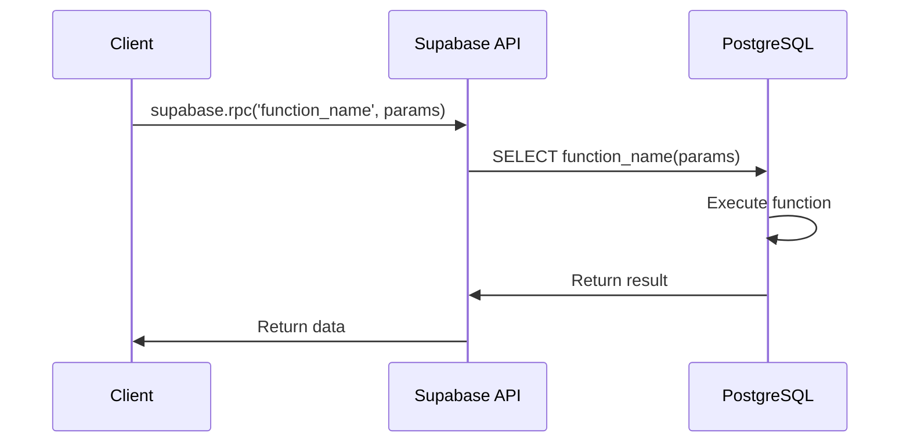
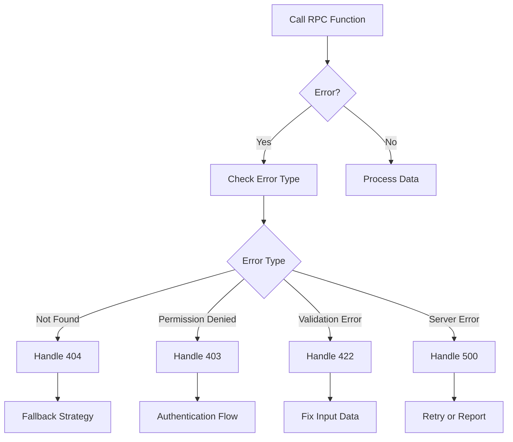
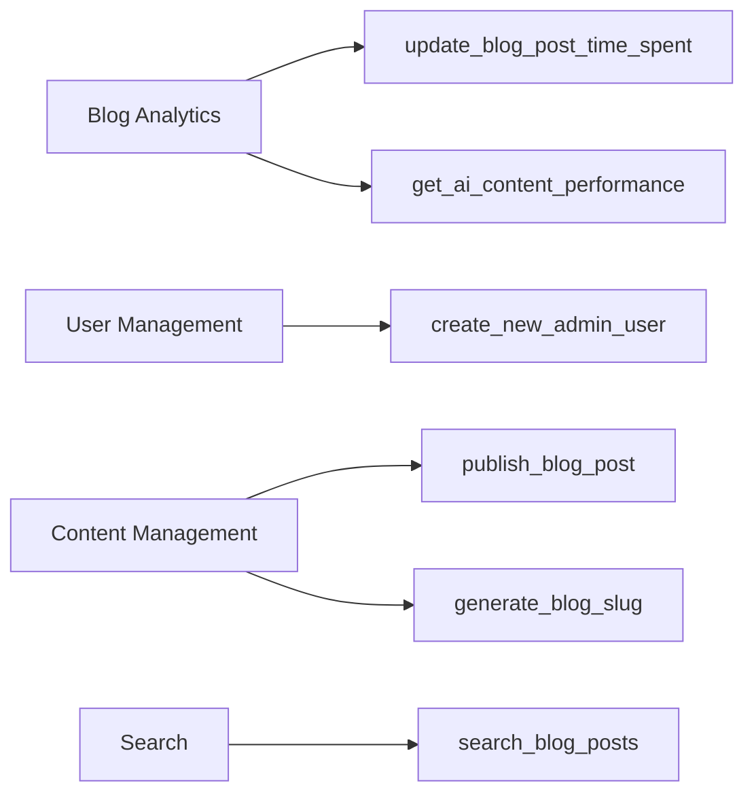

# Remote Procedure Calls (RPC) in Supabase

## Overview

Remote Procedure Calls (RPCs) in Supabase allow you to execute custom PostgreSQL functions directly from your client application. This document explains how RPCs work, their benefits, implementation patterns, and best practices.

## Table of Contents

- [What is an RPC?](#what-is-an-rpc)
- [Benefits of Using RPCs](#benefits-of-using-rpcs)
- [How RPCs Work in Supabase](#how-rpcs-work-in-supabase)
- [Creating RPC Functions](#creating-rpc-functions)
- [Calling RPC Functions](#calling-rpc-functions)
- [Error Handling](#error-handling)
- [Security Considerations](#security-considerations)
- [Performance Optimization](#performance-optimization)
- [Common Use Cases](#common-use-cases)
- [Troubleshooting](#troubleshooting)

## What is an RPC?

A Remote Procedure Call (RPC) is a protocol that allows a client application to execute a procedure (function) on a remote server as if it were a local function call. In the context of Supabase, RPCs are PostgreSQL functions that you define in your database and then call from your client application through the Supabase API.



## Benefits of Using RPCs

RPCs offer several advantages over traditional API approaches:

1. **Encapsulation of Business Logic**: Keep complex business logic in the database, close to your data.
2. **Performance**: Reduce network round-trips by performing multiple operations in a single call.
3. **Security**: Implement access control at the database level.
4. **Reusability**: The same function can be used by multiple clients or services.
5. **Transactional Integrity**: Ensure that multiple operations succeed or fail as a unit.
6. **Reduced Boilerplate**: Avoid writing repetitive CRUD operations in your application code.

## How RPCs Work in Supabase

```mermaid
flowchart TD
    A[Client Application] -->|supabase.rpc()| B[Supabase API]
    B -->|PostgREST| C[PostgreSQL]
    C -->|Execute Function| D[Database Function]
    D -->|Return Result| C
    C -->|Format Response| B
    B -->|JSON Response| A
    
    subgraph Database
    C
    D
    end
    
    subgraph Supabase
    B
    end
```

1. You define a PostgreSQL function in your database using SQL.
2. Supabase's PostgREST layer automatically exposes this function as an API endpoint.
3. Your client application calls the function using `supabase.rpc()`.
4. The function executes in the database and returns the result.
5. Supabase formats the result and returns it to your client.

## Creating RPC Functions

RPC functions are created using SQL in your migration files. Here's a basic template:

```sql
CREATE OR REPLACE FUNCTION schema_name.function_name(param1 TYPE, param2 TYPE)
RETURNS return_type AS $$
BEGIN
  -- Function logic here
  RETURN result;
END;
$$ LANGUAGE plpgsql;
```

### Example: Update Blog Post Time Spent

```sql
CREATE OR REPLACE FUNCTION portfolio.update_blog_post_time_spent(post_id UUID, time_spent INTEGER)
RETURNS VOID AS $$
BEGIN
  -- Check if analytics record exists for this post
  IF EXISTS (SELECT 1 FROM portfolio.blog_post_analytics WHERE post_id = $1) THEN
    -- Update existing record
    UPDATE portfolio.blog_post_analytics
    SET 
      total_time_spent = total_time_spent + $2,
      view_count_for_time = view_count_for_time + 1,
      avg_time_spent = (total_time_spent + $2) / (view_count_for_time + 1)
    WHERE post_id = $1;
  ELSE
    -- Create new record
    INSERT INTO portfolio.blog_post_analytics (
      post_id, 
      avg_time_spent, 
      total_time_spent, 
      view_count_for_time,
      views
    )
    VALUES (
      $1, 
      $2, 
      $2, 
      1,
      1
    );
  END IF;
END;
$$ LANGUAGE plpgsql;
```

## Calling RPC Functions

From your client application, you can call RPC functions using the Supabase client:

```typescript
// Basic RPC call
const { data, error } = await supabase
  .rpc('function_name', { param1: value1, param2: value2 });

// Example: Update blog post time spent
const { data, error } = await supabase
  .rpc('update_blog_post_time_spent', {
    post_id: '123e4567-e89b-12d3-a456-426614174000',
    time_spent: 120
  });
```

## Error Handling

When working with RPCs, it's important to handle errors properly:

```typescript
const { data, error } = await supabase
  .rpc('function_name', params);

if (error) {
  console.error('Error calling RPC function:', error);
  // Handle the error appropriately
  return;
}

// Process the data
console.log('RPC function returned:', data);
```

### Common Error Patterns



## Security Considerations

When implementing RPC functions, consider the following security aspects:

1. **Row-Level Security (RLS)**: Apply RLS policies to tables accessed by your functions.
2. **Input Validation**: Validate all input parameters to prevent SQL injection.
3. **Permission Checks**: Verify that the user has the necessary permissions.
4. **SECURITY DEFINER vs SECURITY INVOKER**: Understand the security context in which your function runs.

### Example: Secure RPC Function

```sql
-- Function that respects RLS policies
CREATE OR REPLACE FUNCTION portfolio.get_user_blog_analytics(user_id UUID)
RETURNS TABLE (post_id UUID, views INTEGER, avg_time_spent FLOAT) 
SECURITY INVOKER -- Run with the permissions of the calling user
AS $$
BEGIN
  RETURN QUERY
  SELECT a.post_id, a.views, a.avg_time_spent
  FROM portfolio.blog_post_analytics a
  JOIN portfolio.blog_posts p ON a.post_id = p.id
  WHERE p.author_id = user_id;
END;
$$ LANGUAGE plpgsql;
```

## Performance Optimization

To optimize RPC performance:

1. **Minimize Database Roundtrips**: Perform all necessary operations within the function.
2. **Use Appropriate Indexes**: Ensure that tables accessed by your functions are properly indexed.
3. **Return Only Necessary Data**: Limit the amount of data returned to what's actually needed.
4. **Consider Caching**: For frequently called functions with stable results, implement caching.

## Common Use Cases

RPCs are particularly useful for:

1. **Complex Calculations**: Aggregate data or perform statistical analysis.
2. **Multi-Step Operations**: Execute multiple related operations in a single transaction.
3. **Custom Authentication Logic**: Implement specialized authentication flows.
4. **Data Transformations**: Convert data between formats or structures.
5. **Batch Operations**: Process multiple records in a single call.

### Example Use Cases in Our Portfolio Application



## Troubleshooting

Common issues when working with RPCs:

1. **Function Not Found**: Ensure the function exists in the correct schema.
2. **Parameter Type Mismatch**: Check that parameter types match the function definition.
3. **Permission Denied**: Verify that the user has the necessary permissions.
4. **Timeout**: For long-running functions, consider implementing asynchronous processing.

### Debugging Tips

1. Test your functions directly in the database using a SQL client.
2. Use `RAISE NOTICE` statements to log debug information.
3. Check the Supabase logs for error messages.
4. Implement proper error handling in your functions to return meaningful error messages.

## Conclusion

RPCs in Supabase provide a powerful way to extend your database's capabilities and simplify your application architecture. By moving complex logic to the database, you can improve performance, security, and maintainability while reducing the amount of code in your client application.

When implemented correctly, RPCs can significantly enhance your application's architecture by providing a clean separation of concerns and enabling powerful server-side operations with minimal client-side code.
