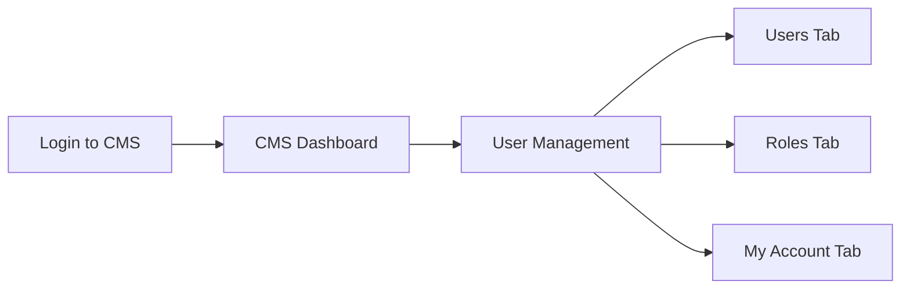

# User Management - Administrator Guide

This guide provides step-by-step instructions for common user management tasks in the portfolio application.

## Accessing User Management

1. Log in to the CMS with your administrator credentials
2. Navigate to the "User Management" section from the main menu
3. You will see the User Management dashboard with three tabs:
   - Users
   - Roles
   - My Account



## Managing Users

### Viewing Users

The Users tab displays a list of all users in the system, including:
- Email address
- Name
- Roles
- Creation date
- Last sign-in date

You can search for users by name or email using the search box at the top of the list.

### Creating a New User

```mermaid
flowchart TD
    Start([Start]) --> UsersTab[Go to Users Tab]
    UsersTab --> AddButton[Click "Add User" Button]
    AddButton --> FillForm[Fill User Form]
    FillForm --> Email[Enter Email]
    FillForm --> Name[Enter Name]
    FillForm --> Password[Enter Password]
    FillForm --> ConfirmPassword[Confirm Password]
    FillForm --> SelectRoles[Select Roles]
    SelectRoles --> Submit[Click "Create User"]
    Submit --> Success{Success?}
    Success -->|Yes| UserCreated[User Created]
    Success -->|No| ErrorMessage[View Error Message]
    ErrorMessage --> FixErrors[Fix Errors]
    FixErrors --> Submit
    UserCreated --> End([End])
```

To create a new user:

1. Go to the Users tab
2. Click the "Add User" button
3. Fill in the user form:
   - Email address (required)
   - Name (required)
   - Password (required, minimum 8 characters)
   - Confirm password
   - Select one or more roles
4. Click "Create User"
5. If successful, the new user will appear in the users list
6. If there are errors, fix them and try again

### Editing a User

To edit an existing user:

1. Go to the Users tab
2. Find the user you want to edit
3. Click the "Edit" button for that user
4. Update the user information:
   - Email address
   - Name
   - Password (leave blank to keep the current password)
   - Roles
5. Click "Update User"
6. Verify your admin password when prompted
7. If successful, the updated user information will appear in the users list

### Deleting a User

To delete a user:

1. Go to the Users tab
2. Find the user you want to delete
3. Click the "Delete" button for that user
4. Confirm the deletion in the confirmation dialog
5. If successful, the user will be removed from the users list

> **Warning**: Deleting a user is permanent and cannot be undone. All data associated with the user will be deleted.

## Managing Roles

### Viewing Roles

The Roles tab displays a list of all roles in the system, including:
- Name
- Description
- Permissions
- Number of users with the role

### Creating a New Role

```mermaid
flowchart TD
    Start([Start]) --> RolesTab[Go to Roles Tab]
    RolesTab --> AddButton[Click "Add Role" Button]
    AddButton --> FillForm[Fill Role Form]
    FillForm --> Name[Enter Role Name]
    FillForm --> Description[Enter Description]
    FillForm --> SelectPermissions[Select Permissions]
    SelectPermissions --> Submit[Click "Create Role"]
    Submit --> Success{Success?}
    Success -->|Yes| RoleCreated[Role Created]
    Success -->|No| ErrorMessage[View Error Message]
    ErrorMessage --> FixErrors[Fix Errors]
    FixErrors --> Submit
    RoleCreated --> End([End])
```

To create a new role:

1. Go to the Roles tab
2. Click the "Add Role" button
3. Fill in the role form:
   - Name (required, must be unique)
   - Description
   - Select permissions
4. Click "Create Role"
5. If successful, the new role will appear in the roles list

### Editing a Role

To edit an existing role:

1. Go to the Roles tab
2. Find the role you want to edit
3. Click the "Edit" button for that role
4. Update the role information:
   - Name
   - Description
   - Permissions
5. Click "Update Role"
6. If successful, the updated role information will appear in the roles list

### Deleting a Role

To delete a role:

1. Go to the Roles tab
2. Find the role you want to delete
3. Click the "Delete" button for that role
4. Confirm the deletion in the confirmation dialog
5. If successful, the role will be removed from the roles list

> **Note**: You cannot delete a role that is assigned to users. You must first remove the role from all users before deleting it.

## Managing Your Account

### Updating Your Profile

To update your profile information:

1. Go to the My Account tab
2. Update your profile information:
   - Name
   - Email address
3. Click "Update Profile"
4. Verify your password when prompted
5. If successful, your profile will be updated

### Changing Your Password

```mermaid
flowchart TD
    Start([Start]) --> AccountTab[Go to My Account Tab]
    AccountTab --> PasswordSection[Go to Password Section]
    PasswordSection --> EnterNewPassword[Enter New Password]
    EnterNewPassword --> ConfirmPassword[Confirm New Password]
    ConfirmPassword --> Submit[Click "Change Password"]
    Submit --> VerifyPassword[Enter Current Password]
    VerifyPassword --> Success{Success?}
    Success -->|Yes| PasswordChanged[Password Changed]
    Success -->|No| ErrorMessage[View Error Message]
    ErrorMessage --> FixErrors[Fix Errors]
    FixErrors --> Submit
    PasswordChanged --> End([End])
```

To change your password:

1. Go to the My Account tab
2. Enter your new password
3. Confirm your new password
4. Click "Change Password"
5. Verify your current password when prompted
6. If successful, your password will be updated

## Understanding Permissions

The system uses a role-based access control (RBAC) model with the following permissions:

| Permission | Description |
|------------|-------------|
| create_posts | Can create blog posts |
| edit_posts | Can edit blog posts |
| delete_posts | Can delete blog posts |
| manage_comments | Can manage blog comments |
| manage_users | Can manage users |
| manage_roles | Can manage roles |
| manage_media | Can upload and manage media files |
| manage_settings | Can change site settings |
| view_analytics | Can view site analytics |

### Default Roles

The system comes with three default roles:

1. **Admin**: Has all permissions
2. **Content Editor**: Can create and edit content, manage comments, manage media, and view analytics
3. **Viewer**: Can only view analytics

## Best Practices

### User Management

1. **Principle of Least Privilege**: Assign users only the permissions they need to perform their tasks
2. **Regular Audits**: Periodically review user accounts and roles to ensure they are still needed
3. **Strong Passwords**: Enforce strong password policies
4. **Account Deactivation**: Deactivate accounts when users leave rather than deleting them immediately

### Role Management

1. **Role Granularity**: Create roles with specific purposes rather than general-purpose roles
2. **Role Documentation**: Document the purpose and permissions of each role
3. **Role Review**: Periodically review roles to ensure they still serve their intended purpose

## Troubleshooting

### Common Issues

1. **Cannot create a user**: Ensure you have the `manage_users` permission
2. **Cannot create a role**: Ensure you have the `manage_roles` permission
3. **Cannot delete a role**: Ensure the role is not assigned to any users
4. **Password verification fails**: Ensure you are entering your current password correctly

### Error Messages

| Error Message | Possible Cause | Solution |
|---------------|----------------|----------|
| "Email already in use" | The email address is already registered | Use a different email address |
| "Password is too weak" | The password does not meet the minimum requirements | Use a stronger password |
| "Permission denied" | You do not have the required permission | Contact an administrator |
| "Role is in use" | The role is assigned to one or more users | Remove the role from all users first |

## Audit Logs

The system maintains audit logs for all user management actions, including:

1. User creation
2. User updates
3. User deletion
4. Role creation
5. Role updates
6. Role deletion
7. Password changes

Administrators can view these logs to track changes to the system.

## Security Recommendations

1. **Regular Password Changes**: Encourage users to change their passwords regularly
2. **Two-Factor Authentication**: Consider enabling two-factor authentication for sensitive accounts
3. **Session Timeouts**: Configure appropriate session timeouts to prevent unauthorized access
4. **Access Reviews**: Regularly review user access and permissions
5. **Security Training**: Provide security awareness training to all users
