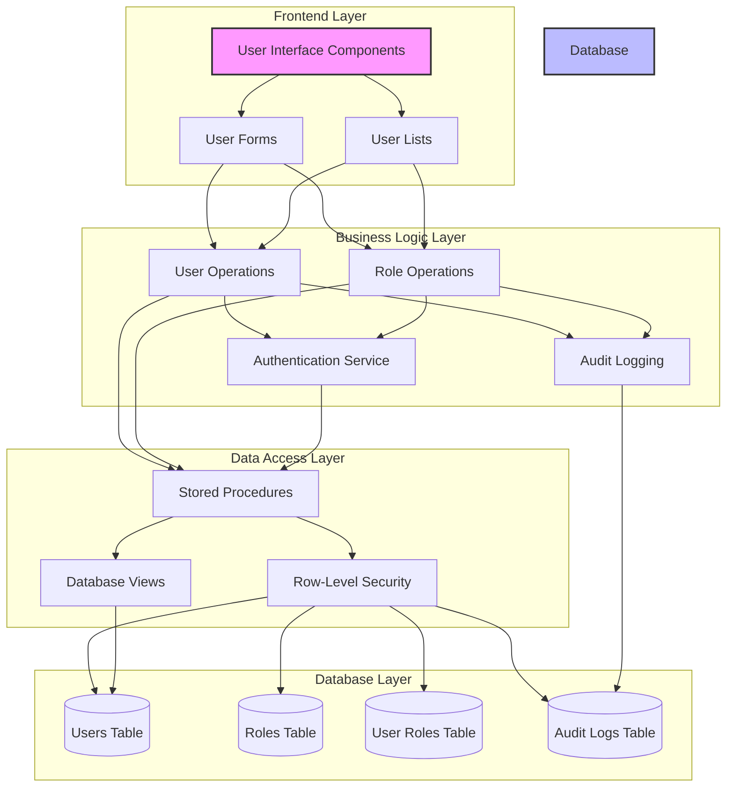
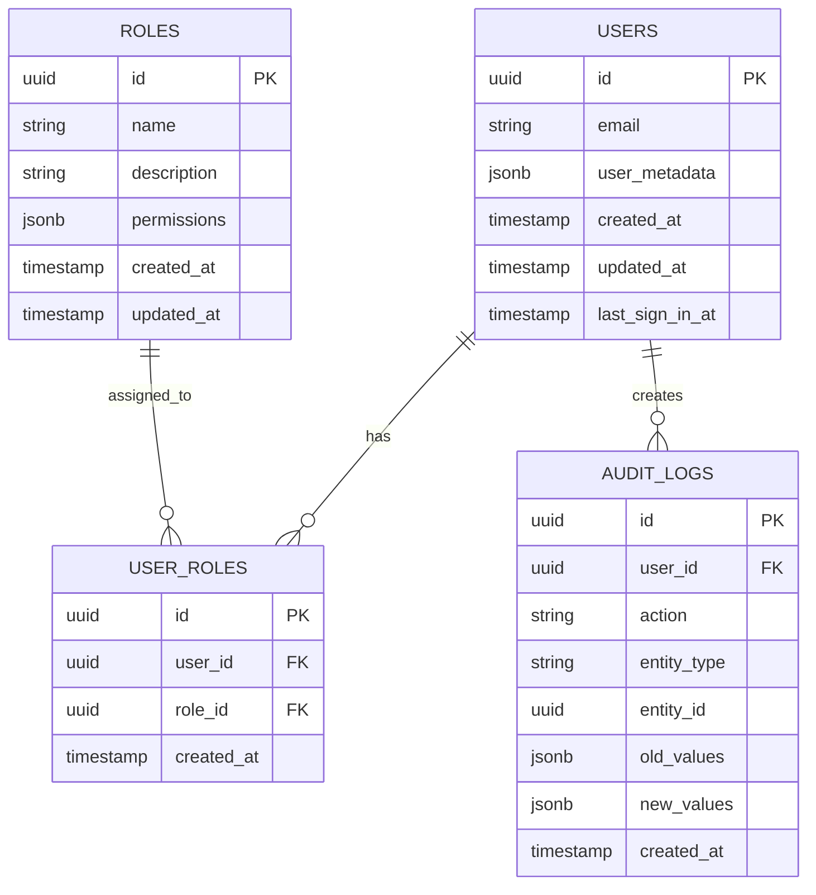
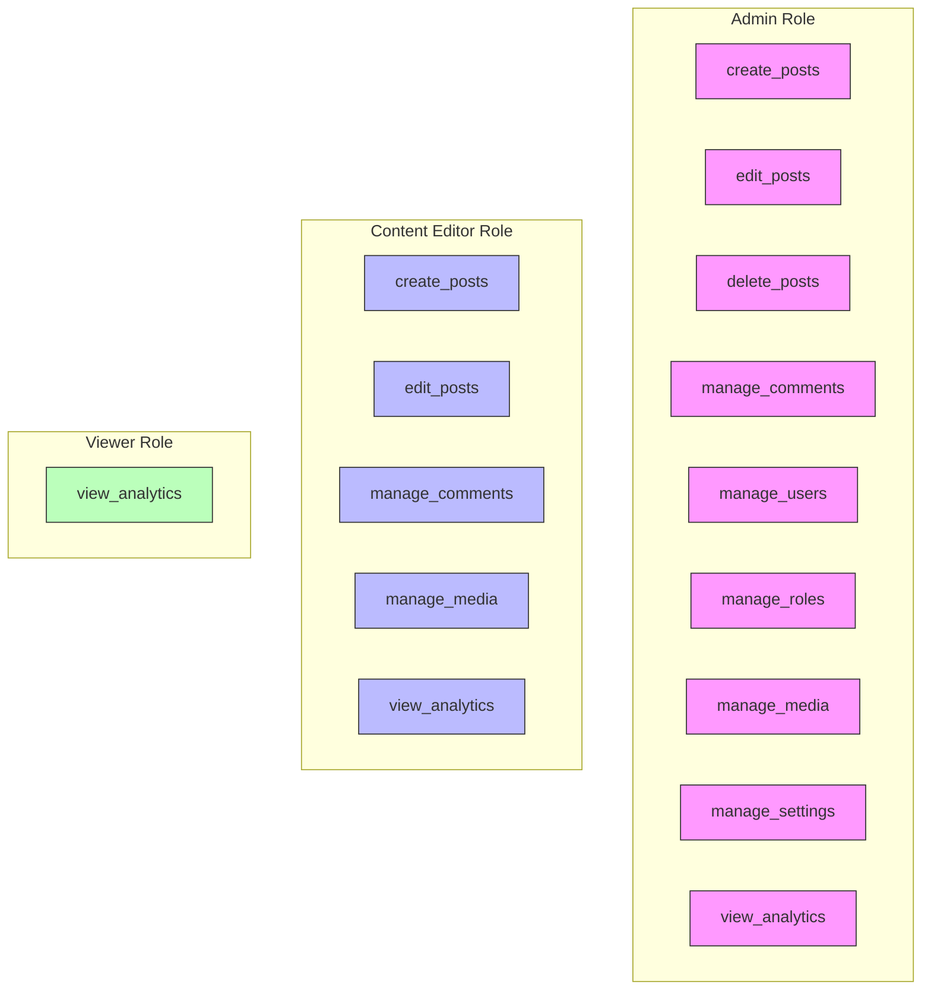
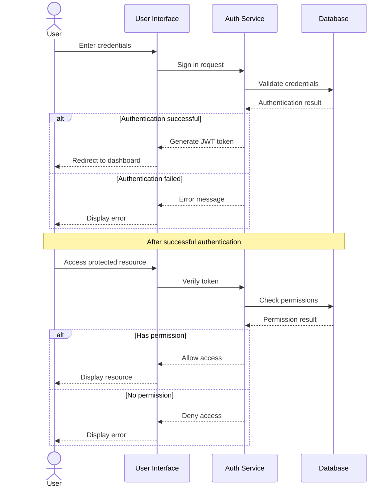
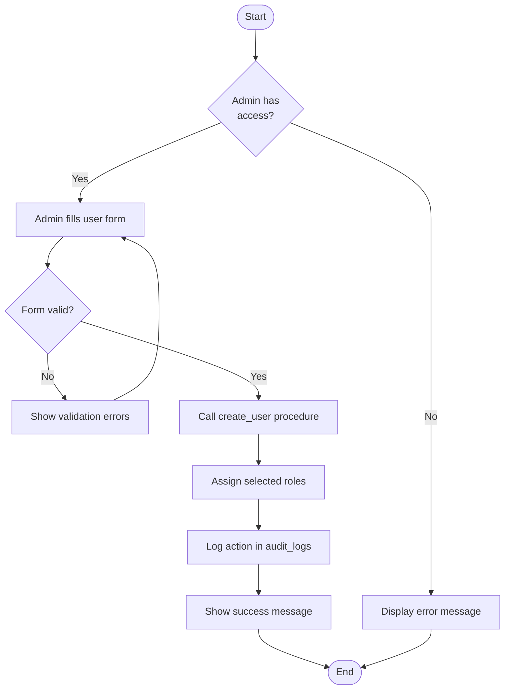
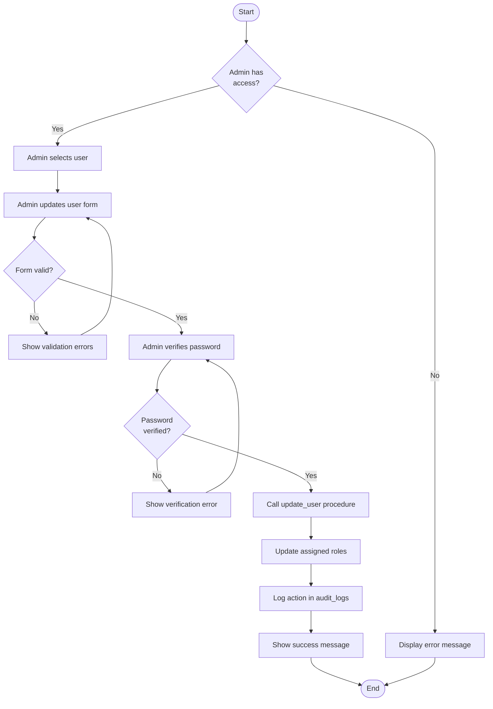
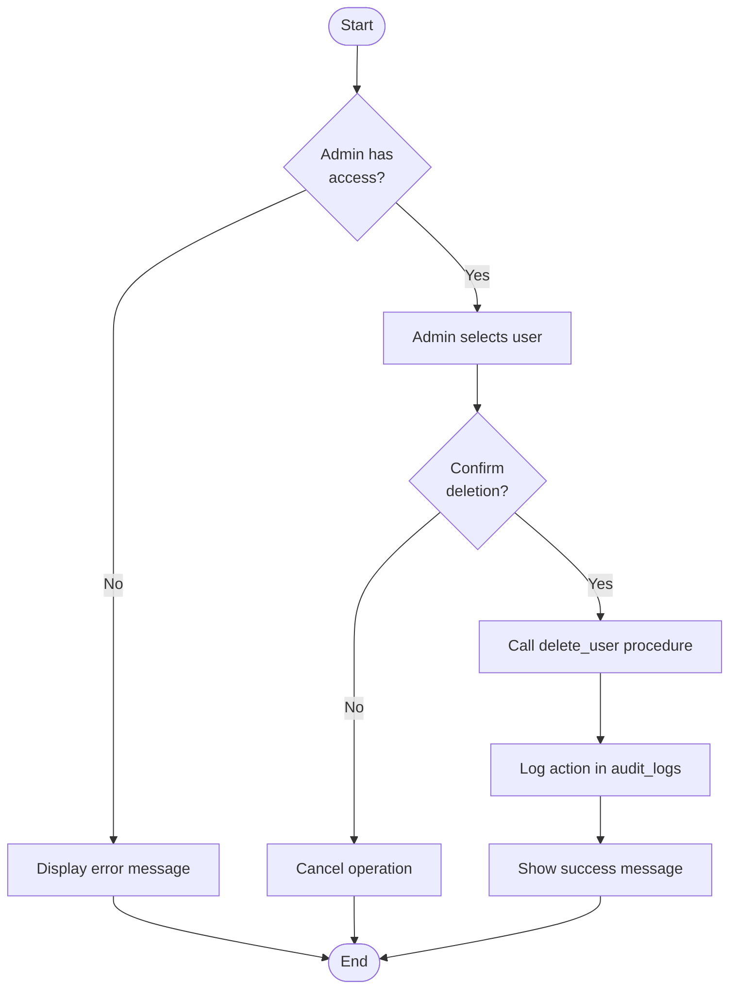
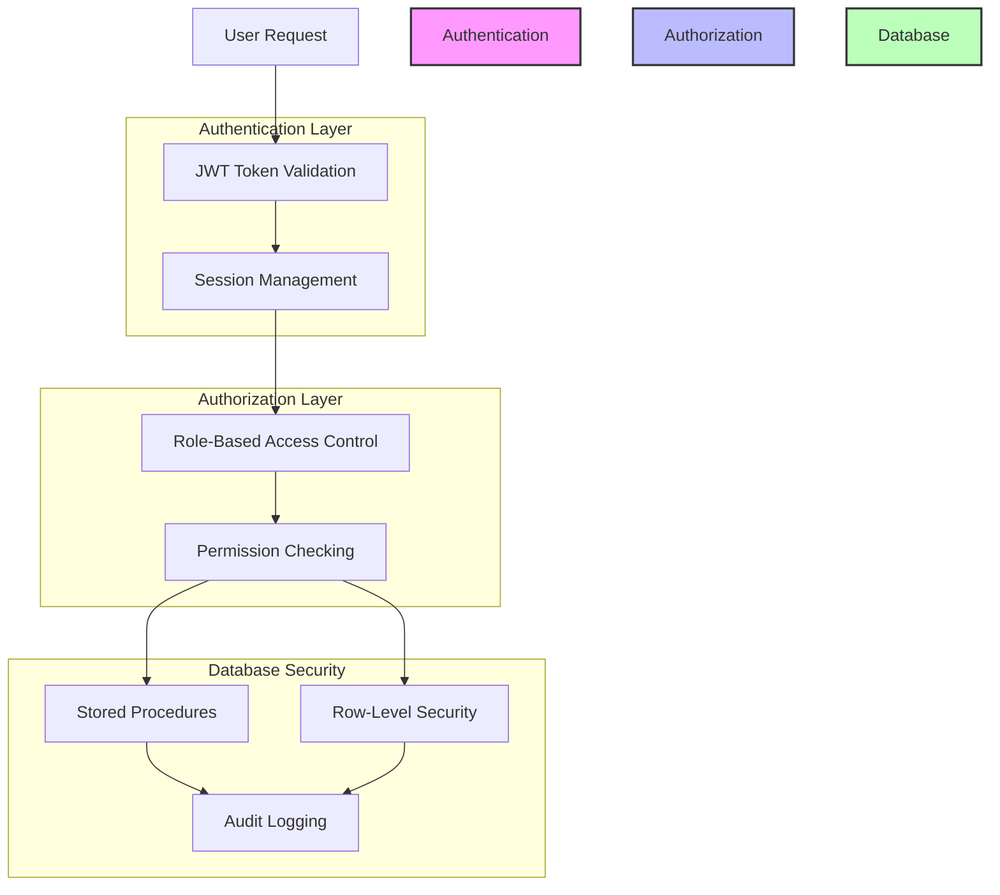

# User Management System Documentation

## Overview

The User Management System provides a comprehensive solution for managing users, roles, and permissions within the portfolio application. It enables administrators to create, update, and delete users, assign roles with specific permissions, and maintain a secure audit trail of all user-related activities.

## System Architecture

The user management system follows a layered architecture pattern with clear separation of concerns:



## Database Schema

The user management system relies on the following database tables:



## User Roles and Permissions

The system implements a role-based access control (RBAC) model where users are assigned roles, and roles contain specific permissions.

### Default Roles



## Authentication Flow

The authentication flow for the user management system:



## User Management Operations

### User Creation Process



### User Update Process



### User Deletion Process



## Security Features

The user management system implements several security features to ensure data protection and access control:

1. **Password Verification**: Sensitive actions (like updating user information or changing passwords) require password verification.

2. **Audit Logging**: All important actions are logged in the audit_logs table, including:
   - User creation and updates
   - Role creation and updates
   - Password changes
   - Profile updates

3. **Row-Level Security (RLS)**: Database tables are protected with RLS policies to ensure users can only access data they're authorized to see.

4. **First User Admin**: The first user created in the system is automatically assigned the admin role.

5. **Stored Procedures**: User management operations are performed through stored procedures that enforce permission checks:
   - `create_user`: Creates a new user with specified roles
   - `update_user`: Updates an existing user's information and roles
   - `delete_user`: Deletes a user
   - These procedures ensure that only users with the appropriate permissions can perform these actions.

## Security Implementation



## API Endpoints and Functions

The user management system exposes the following API endpoints and functions:

### User Management

| Function | Description | Required Permission |
|----------|-------------|---------------------|
| `create_user` | Creates a new user with specified roles | `manage_users` |
| `update_user` | Updates an existing user's information and roles | `manage_users` |
| `delete_user` | Deletes a user | `manage_users` |
| `get_user_roles` | Gets the roles assigned to a user | `manage_users` |

### Role Management

| Function | Description | Required Permission |
|----------|-------------|---------------------|
| `create_role` | Creates a new role with specified permissions | `manage_roles` |
| `update_role` | Updates an existing role's information and permissions | `manage_roles` |
| `delete_role` | Deletes a role | `manage_roles` |

### Permission Checking

| Function | Description |
|----------|-------------|
| `has_permission` | Checks if a user has a specific permission |
| `user_is_admin` | Checks if a user has the admin role |

## Implementation Details

### Database Views

The system uses a database view (`users_view`) to provide a secure way to access user data without exposing sensitive information.

### Stored Procedures

Stored procedures are used to encapsulate business logic and enforce security checks:

```sql
-- Example of the create_user stored procedure
CREATE OR REPLACE FUNCTION portfolio.create_user(
  user_email TEXT,
  user_password TEXT,
  user_name TEXT,
  user_roles UUID[]
) RETURNS JSONB AS $$
DECLARE
  new_user_id UUID;
  role_id UUID;
  result JSONB;
BEGIN
  -- Check if the current user has permission to create users
  IF NOT portfolio.has_permission(auth.uid(), 'manage_users') THEN
    RAISE EXCEPTION 'Permission denied: You do not have permission to create users';
  END IF;

  -- Create the user
  -- ... implementation details ...

  RETURN result;
END;
$$ LANGUAGE plpgsql SECURITY DEFINER;
```

## Best Practices

1. **Always verify permissions** before performing sensitive operations
2. **Log all important actions** in the audit_logs table
3. **Use stored procedures** for database operations to enforce security checks
4. **Implement password verification** for sensitive actions
5. **Follow the principle of least privilege** when assigning roles and permissions

## Troubleshooting

### Common Issues

1. **403 Forbidden errors**: Usually indicates a permission issue. Check that the user has the required role and permissions.
2. **User creation failures**: Ensure the email is unique and all required fields are provided.
3. **Role assignment issues**: Verify that the role exists and the user has permission to assign roles.

### Debugging Tips

1. Check the browser console for error messages
2. Review the audit_logs table for failed operations
3. Verify that the user has the required permissions
4. Ensure that the database schema is up to date
