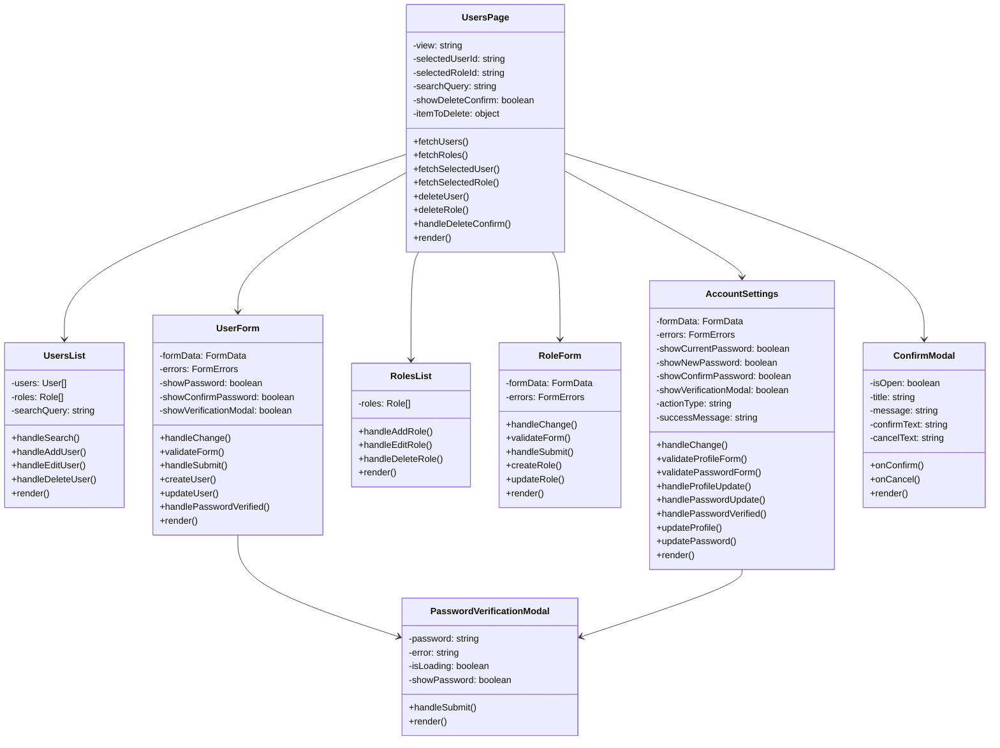
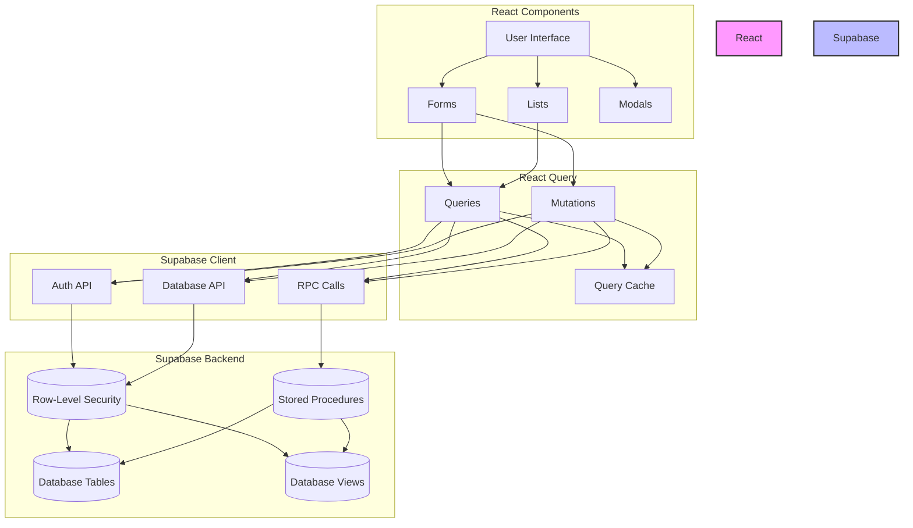

# User Management System - Technical Documentation

## Technical Architecture

The user management system is built on a modern stack using React, TypeScript, and Supabase, following a layered architecture pattern that separates concerns and promotes maintainability.

## Component Architecture



## Data Flow



## Database Schema Details

### Users Table (auth.users)

| Column | Type | Description |
|--------|------|-------------|
| id | UUID | Primary key |
| email | TEXT | User's email address |
| encrypted_password | TEXT | Encrypted password (managed by Supabase Auth) |
| email_confirmed_at | TIMESTAMP | When email was confirmed |
| last_sign_in_at | TIMESTAMP | Last sign-in timestamp |
| created_at | TIMESTAMP | Creation timestamp |
| updated_at | TIMESTAMP | Last update timestamp |
| user_metadata | JSONB | Custom user metadata (name, etc.) |

### Roles Table (portfolio.roles)

| Column | Type | Description |
|--------|------|-------------|
| id | UUID | Primary key |
| name | TEXT | Role name (unique) |
| description | TEXT | Role description |
| permissions | JSONB | Array of permission strings |
| created_at | TIMESTAMP | Creation timestamp |
| updated_at | TIMESTAMP | Last update timestamp |

### User Roles Table (portfolio.user_roles)

| Column | Type | Description |
|--------|------|-------------|
| id | UUID | Primary key |
| user_id | UUID | Foreign key to auth.users |
| role_id | UUID | Foreign key to portfolio.roles |
| created_at | TIMESTAMP | Creation timestamp |

### Audit Logs Table (portfolio.audit_logs)

| Column | Type | Description |
|--------|------|-------------|
| id | UUID | Primary key |
| user_id | UUID | Foreign key to auth.users |
| action | TEXT | Action performed (create, update, delete) |
| entity_type | TEXT | Type of entity (user, role) |
| entity_id | UUID | ID of the affected entity |
| old_values | JSONB | Previous values (for updates) |
| new_values | JSONB | New values |
| created_at | TIMESTAMP | Creation timestamp |

## Database Functions and Stored Procedures

### Permission Checking

```sql
-- Check if user has a specific permission
CREATE OR REPLACE FUNCTION portfolio.has_permission(user_id UUID, permission TEXT)
RETURNS BOOLEAN AS $$
DECLARE
  has_perm BOOLEAN;
BEGIN
  SELECT EXISTS (
    SELECT 1
    FROM portfolio.user_roles ur
      JOIN portfolio.roles r ON ur.role_id = r.id
    WHERE ur.user_id = user_id
      AND permission = ANY(
        ARRAY(
          SELECT jsonb_array_elements_text(r.permissions)
        )
      )
  ) INTO has_perm;
  
  RETURN has_perm;
END;
$$ LANGUAGE plpgsql SECURITY DEFINER;

-- Check if user is an admin
CREATE OR REPLACE FUNCTION portfolio.is_admin(user_id UUID)
RETURNS BOOLEAN AS $$
DECLARE
  is_admin_user BOOLEAN;
BEGIN
  SELECT EXISTS (
    SELECT 1
    FROM portfolio.user_roles ur
      JOIN portfolio.roles r ON ur.role_id = r.id
    WHERE ur.user_id = user_id
      AND r.name = 'admin'
  ) INTO is_admin_user;
  
  RETURN is_admin_user;
END;
$$ LANGUAGE plpgsql SECURITY DEFINER;
```

### User Management Procedures

```sql
-- Create a user
CREATE OR REPLACE FUNCTION portfolio.create_user(
  user_email TEXT,
  user_password TEXT,
  user_name TEXT,
  user_roles UUID[]
)
RETURNS JSONB AS $$
DECLARE
  new_user_id UUID;
  role_id UUID;
  result JSONB;
BEGIN
  -- Check if the current user has permission to create users
  IF NOT portfolio.has_permission(auth.uid(), 'manage_users') THEN
    RAISE EXCEPTION 'Permission denied: You do not have permission to create users';
  END IF;

  -- Create the user in auth.users
  -- This is a simplified version - in a real implementation, you would use
  -- Supabase's server-side functions or Edge Functions to create the user
  new_user_id := uuid_generate_v4();
  
  -- Insert into users_view
  INSERT INTO portfolio.users_view (
    id,
    email,
    user_metadata,
    created_at
  ) VALUES (
    new_user_id,
    user_email,
    jsonb_build_object('name', user_name),
    NOW()
  );
  
  -- Assign roles to the user
  FOREACH role_id IN ARRAY user_roles
  LOOP
    INSERT INTO portfolio.user_roles (user_id, role_id)
    VALUES (new_user_id, role_id);
  END LOOP;
  
  -- Return the user data
  result := jsonb_build_object(
    'id', new_user_id,
    'email', user_email,
    'user_metadata', jsonb_build_object('name', user_name),
    'created_at', NOW()
  );
  
  RETURN result;
END;
$$ LANGUAGE plpgsql SECURITY DEFINER;

-- Update a user
CREATE OR REPLACE FUNCTION portfolio.update_user(
  user_id UUID,
  user_email TEXT,
  user_password TEXT,
  user_name TEXT,
  user_roles UUID[]
)
RETURNS JSONB AS $$
DECLARE
  role_id UUID;
  result JSONB;
BEGIN
  -- Check if the current user has permission to update users
  IF NOT portfolio.has_permission(auth.uid(), 'manage_users') THEN
    RAISE EXCEPTION 'Permission denied: You do not have permission to update users';
  END IF;

  -- Update the user in users_view
  UPDATE portfolio.users_view
  SET
    email = user_email,
    user_metadata = jsonb_build_object('name', user_name),
    updated_at = NOW()
  WHERE id = user_id;
  
  -- Delete existing roles
  DELETE FROM portfolio.user_roles
  WHERE user_id = user_id;
  
  -- Assign new roles
  FOREACH role_id IN ARRAY user_roles
  LOOP
    INSERT INTO portfolio.user_roles (user_id, role_id)
    VALUES (user_id, role_id);
  END LOOP;
  
  -- Return success
  result := jsonb_build_object(
    'success', true,
    'id', user_id
  );
  
  RETURN result;
END;
$$ LANGUAGE plpgsql SECURITY DEFINER;

-- Delete a user
CREATE OR REPLACE FUNCTION portfolio.delete_user(
  user_id UUID
)
RETURNS JSONB AS $$
DECLARE
  result JSONB;
BEGIN
  -- Check if the current user has permission to delete users
  IF NOT portfolio.has_permission(auth.uid(), 'manage_users') THEN
    RAISE EXCEPTION 'Permission denied: You do not have permission to delete users';
  END IF;

  -- Delete the user from users_view
  DELETE FROM portfolio.users_view
  WHERE id = user_id;
  
  -- Return success
  result := jsonb_build_object(
    'success', true,
    'id', user_id
  );
  
  RETURN result;
END;
$$ LANGUAGE plpgsql SECURITY DEFINER;
```

## Row-Level Security Policies

```sql
-- Users View RLS Policies
ALTER VIEW portfolio.users_view SECURITY INVOKER;

-- Create a policy to allow users with manage_users permission to view all users
CREATE POLICY "Users are viewable by users with manage_users permission"
  ON portfolio.users_view FOR SELECT
  TO authenticated
  USING (
    portfolio.has_permission(auth.uid(), 'manage_users')
  );

-- Create a policy to allow users to view their own user data
CREATE POLICY "Users can view their own data"
  ON portfolio.users_view FOR SELECT
  TO authenticated
  USING (
    id = auth.uid()
  );

-- Roles Table RLS Policies
ALTER TABLE portfolio.roles ENABLE ROW LEVEL SECURITY;

CREATE POLICY "Roles are viewable by authenticated users"
  ON portfolio.roles FOR SELECT
  TO authenticated
  USING (true);

CREATE POLICY "Roles can be inserted by users with manage_roles permission"
  ON portfolio.roles FOR INSERT
  TO authenticated
  WITH CHECK (
    portfolio.has_permission(auth.uid(), 'manage_roles')
  );

CREATE POLICY "Roles can be updated by users with manage_roles permission"
  ON portfolio.roles FOR UPDATE
  TO authenticated
  USING (
    portfolio.has_permission(auth.uid(), 'manage_roles')
  );

CREATE POLICY "Roles can be deleted by users with manage_roles permission"
  ON portfolio.roles FOR DELETE
  TO authenticated
  USING (
    portfolio.has_permission(auth.uid(), 'manage_roles')
  );

-- User Roles Table RLS Policies
ALTER TABLE portfolio.user_roles ENABLE ROW LEVEL SECURITY;

CREATE POLICY "User roles are viewable by authenticated users"
  ON portfolio.user_roles FOR SELECT
  TO authenticated
  USING (true);

CREATE POLICY "User roles can be inserted by users with manage_users permission"
  ON portfolio.user_roles FOR INSERT
  TO authenticated
  WITH CHECK (
    portfolio.has_permission(auth.uid(), 'manage_users')
  );

CREATE POLICY "User roles can be deleted by users with manage_users permission"
  ON portfolio.user_roles FOR DELETE
  TO authenticated
  USING (
    portfolio.has_permission(auth.uid(), 'manage_users')
  );

-- Audit Logs Table RLS Policies
ALTER TABLE portfolio.audit_logs ENABLE ROW LEVEL SECURITY;

CREATE POLICY "Audit logs are viewable by users with manage_users or manage_roles permission"
  ON portfolio.audit_logs FOR SELECT
  TO authenticated
  USING (
    portfolio.has_permission(auth.uid(), 'manage_users') OR
    portfolio.has_permission(auth.uid(), 'manage_roles')
  );

CREATE POLICY "Audit logs can be inserted by authenticated users"
  ON portfolio.audit_logs FOR INSERT
  TO authenticated
  WITH CHECK (
    auth.uid() = user_id
  );
```

## React Components Implementation

### UsersPage Component

The `UsersPage` component is the main container for the user management interface. It handles the following responsibilities:

1. Fetching users and roles data
2. Managing the current view (users, roles, account settings)
3. Handling user and role selection
4. Coordinating user and role operations (create, update, delete)

```tsx
// UsersPage.tsx
import React, { useState } from 'react';
import { motion } from 'framer-motion';
import { useQuery, useQueryClient, useMutation } from '@tanstack/react-query';
import { supabase } from '../../lib/supabase';
import { useCMS } from '../CMSProvider';

// Components
import UsersList from '../components/users/UsersList';
import UserForm from '../components/users/UserForm';
import RolesList from '../components/users/RolesList';
import RoleForm from '../components/users/RoleForm';
import AccountSettings from '../components/users/AccountSettings';
import LoadingSpinner from '../../components/ui/LoadingSpinner';
import Button from '../../components/ui/Button';
import { ConfirmModal } from '../../components/ui/modals';

// Types
type View = 'users' | 'roles' | 'account' | 'add-user' | 'edit-user' | 'add-role' | 'edit-role';

const UsersPage: React.FC = () => {
  // State and hooks
  const { isAuthenticated, isLoading: authLoading, isAdmin, user } = useCMS();
  const queryClient = useQueryClient();
  const [view, setView] = useState<View>('users');
  const [selectedUserId, setSelectedUserId] = useState<string | null>(null);
  const [selectedRoleId, setSelectedRoleId] = useState<string | null>(null);
  const [searchQuery, setSearchQuery] = useState('');
  const [showDeleteConfirm, setShowDeleteConfirm] = useState(false);
  const [itemToDelete, setItemToDelete] = useState<{ id: string; type: 'user' | 'role' } | null>(null);

  // Fetch users using users_view instead of Admin API
  const {
    data: users,
    isLoading: usersLoading,
    error: usersError,
  } = useQuery({
    queryKey: ['users', searchQuery],
    queryFn: async () => {
      try {
        // Get users from users_view
        const { data: userData, error: userError } = await supabase
          .from('users_view')
          .select(`
            id,
            email,
            created_at,
            last_sign_in_at,
            user_metadata
          `);

        if (userError) {
          throw new Error(userError.message);
        }

        // For each user, get their roles
        const usersWithRoles = await Promise.all(
          userData.map(async (user) => {
            const { data: roleData, error: roleError } = await supabase
              .from('user_roles')
              .select(`
                role_id,
                roles:role_id(id, name, description)
              `)
              .eq('user_id', user.id);

            if (roleError) {
              console.error('Error fetching roles for user:', roleError);
              return {
                ...user,
                roles: [],
              };
            }

            return {
              ...user,
              roles: roleData.map((r) => r.roles),
            };
          })
        );

        // Filter by search query if provided
        if (searchQuery) {
          return usersWithRoles.filter((user) =>
            user.email?.toLowerCase().includes(searchQuery.toLowerCase()) ||
            user.user_metadata?.name?.toLowerCase().includes(searchQuery.toLowerCase())
          );
        }

        return usersWithRoles;
      } catch (error) {
        console.error('Error fetching users:', error);
        throw new Error('Failed to fetch users. You may not have the required permissions.');
      }
    },
    enabled: isAuthenticated && !authLoading && isAdmin,
  });

  // Delete user using stored procedure
  const deleteUserMutation = useMutation({
    mutationFn: async (userId: string) => {
      try {
        // Use stored procedure to delete user
        const { data, error } = await supabase
          .rpc('delete_user', {
            user_id: userId
          });
        
        if (error) {
          throw new Error(error.message);
        }
        
        return { success: true };
      } catch (error) {
        console.error('Error deleting user:', error);
        throw new Error('Failed to delete user. You may not have the required permissions.');
      }
    },
    onSuccess: () => {
      queryClient.invalidateQueries({ queryKey: ['users'] });
    },
  });

  // Render component
  return (
    <div className="py-6">
      <div className="max-w-7xl mx-auto px-4 sm:px-6 md:px-8">
        <motion.div
          initial={{ opacity: 0, y: -10 }}
          animate={{ opacity: 1, y: 0 }}
          className="flex flex-col w-full"
        >
          <h1 className="text-2xl font-semibold text-gray-900 dark:text-white mb-6">User Management</h1>
          <div className="flex flex-wrap gap-3">
            <Button
              variant={view === 'users' || view === 'add-user' || view === 'edit-user' ? 'primary' : 'secondary'}
              onClick={() => {
                setView('users');
                setSelectedUserId(null);
              }}
            >
              Users
            </Button>
            <Button
              variant={view === 'roles' || view === 'add-role' || view === 'edit-role' ? 'primary' : 'secondary'}
              onClick={() => {
                setView('roles');
                setSelectedRoleId(null);
              }}
            >
              Roles
            </Button>
            <Button
              variant={view === 'account' ? 'primary' : 'secondary'}
              onClick={() => setView('account')}
            >
              My Account
            </Button>
          </div>
        </motion.div>

        {/* View content */}
        {/* ... */}
      </div>
    </div>
  );
};

export default UsersPage;
```

## React Query Integration

The user management system uses React Query for data fetching and state management. This provides several benefits:

1. Automatic caching and refetching
2. Loading and error states
3. Optimistic updates
4. Mutation handling

Example of a React Query mutation:

```tsx
// UserForm.tsx
const createUserMutation = useMutation({
  mutationFn: async (data: FormData) => {
    try {
      // Use a stored procedure to create the user with proper permissions
      const { data: userData, error: createError } = await supabase
        .rpc('create_user', {
          user_email: data.email,
          user_password: data.password,
          user_name: data.name,
          user_roles: data.roleIds
        });

      if (createError) {
        throw new Error(createError.message);
      }

      if (!userData) {
        throw new Error('Failed to create user. No user data returned.');
      }

      // Log the successful creation for audit purposes
      await supabase
        .from('audit_logs')
        .insert({
          user_id: (await supabase.auth.getUser()).data.user?.id,
          action: 'create',
          entity_type: 'user',
          entity_id: userData.id,
          new_values: {
            email: data.email,
            name: data.name,
            roles: data.roleIds,
          },
        });

      return userData;
    } catch (error) {
      console.error('Error creating user:', error);
      throw error;
    }
  },
  onSuccess: () => {
    onSuccess();
  },
  onError: (error: Error) => {
    setErrors({
      general: error.message,
    });
  },
});
```

## Security Considerations

### Password Handling

Passwords are never stored in plain text. When creating or updating users, passwords are securely hashed by Supabase Auth before storage.

### Permission Verification

All operations that modify data verify that the current user has the required permissions before proceeding.

### Audit Logging

All sensitive operations are logged in the audit_logs table, providing a complete history of changes to the system.

### Row-Level Security

Database tables are protected by Row-Level Security policies that restrict access based on user permissions.

## Performance Optimization

### Query Optimization

1. Use of database views to minimize data transfer
2. Selective column fetching to reduce payload size
3. Efficient joins to minimize database queries

### React Query Caching

1. Proper cache invalidation to ensure data freshness
2. Optimistic updates for a responsive UI
3. Background refetching to keep data up to date

### Component Optimization

1. Memoization of expensive computations
2. Lazy loading of components
3. Efficient rendering with React's virtual DOM

## Error Handling

### Client-Side Validation

1. Form validation to prevent invalid data submission
2. Error messages for validation failures
3. Disabled submit buttons when forms are invalid

### Server-Side Validation

1. Database constraints to ensure data integrity
2. Permission checks to prevent unauthorized access
3. Error handling in stored procedures

### Error Display

1. User-friendly error messages
2. Contextual error placement
3. Error recovery options

## Testing Strategy

### Unit Testing

1. Component testing with React Testing Library
2. Function testing with Jest
3. Mocking of external dependencies

### Integration Testing

1. API testing with Supertest
2. Database testing with test fixtures
3. End-to-end testing with Cypress

### Manual Testing

1. User flow testing
2. Edge case testing
3. Cross-browser testing

## Deployment Considerations

### Database Migrations

1. Version-controlled migration files
2. Rollback procedures
3. Data integrity checks

### Environment Configuration

1. Environment variables for sensitive information
2. Configuration validation
3. Environment-specific settings

### Monitoring and Logging

1. Error tracking with Sentry
2. Performance monitoring with Supabase
3. Audit logging for security events
