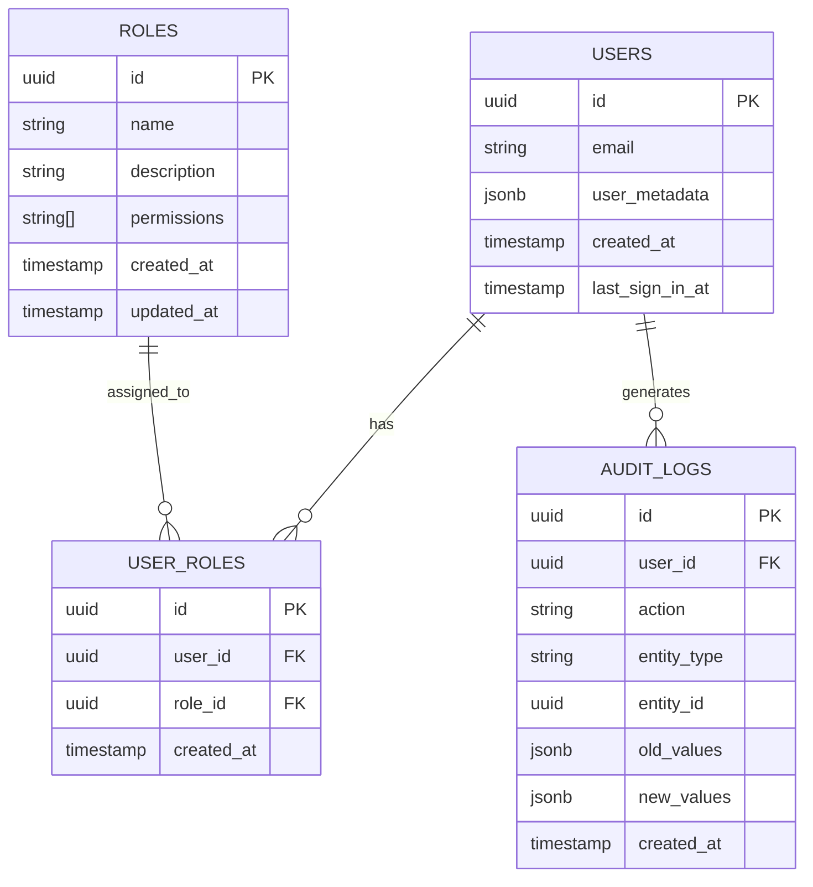

# User Management System

This document describes the user management system implemented in the Portfolio CMS.

## Overview

The user management system allows administrators to:

1. Manage users (create, update, delete)
2. Manage roles and permissions
3. Update their own account settings
4. Track changes through audit logs

## Database Schema

## Roles and Permissions

The system comes with three default roles:

1. **Admin**: Full access to all features
   - Permissions: create_posts, edit_posts, delete_posts, manage_comments, manage_users, manage_roles, manage_media, manage_settings, view_analytics

2. **Content Editor**: Can create and edit content
   - Permissions: create_posts, edit_posts, manage_comments, manage_media, view_analytics

3. **Viewer**: Read-only access
   - Permissions: view_analytics

Administrators can create custom roles with specific permissions as needed.

## Available Permissions

The system supports the following permissions:

- `create_posts`: Can create new blog posts
- `edit_posts`: Can edit existing blog posts
- `delete_posts`: Can delete blog posts
- `manage_comments`: Can moderate comments
- `manage_users`: Can manage users (admin only)
- `manage_roles`: Can manage roles (admin only)
- `manage_media`: Can upload and manage media files
- `manage_settings`: Can change site settings
- `view_analytics`: Can view site analytics

## Security Features

1. **Password Verification**: Sensitive actions (like updating user information or changing passwords) require password verification.

2. **Audit Logging**: All important actions are logged in the audit_logs table, including:
   - User creation and updates
   - Role creation and updates
   - Password changes
   - Profile updates

3. **Row-Level Security (RLS)**: Database tables are protected with RLS policies to ensure users can only access data they're authorized to see.

4. **First User Admin**: The first user created in the system is automatically assigned the admin role.

5. **Stored Procedures**: User management operations are performed through stored procedures that enforce permission checks:
   - `create_user`: Creates a new user with specified roles
   - `update_user`: Updates an existing user's information and roles
   - `delete_user`: Deletes a user
   - These procedures ensure that only users with the appropriate permissions can perform these actions.

## Database Functions

The system provides several helper functions:

1. `has_permission(user_id, permission)`: Checks if a user has a specific permission
2. `is_admin(user_id)`: Checks if a user has the admin role
3. `get_user_roles(user_id)`: Returns all roles assigned to a user

## User Interface

The user management system is accessible through the CMS and provides the following views:

1. **Users List**: View all users, their roles, and when they were created/last active
2. **User Form**: Add or edit users, including assigning roles
3. **Roles List**: View all roles and their descriptions
4. **Role Form**: Add or edit roles, including assigning permissions
5. **Account Settings**: Update personal profile information and change password

## Creating the First Admin User

When you first set up the system, the first user created will automatically be assigned the admin role. This user can then create additional users and assign appropriate roles.

## Best Practices

1. **Principle of Least Privilege**: Assign users only the permissions they need to perform their tasks.
2. **Regular Audits**: Review the audit logs periodically to monitor system activity.
3. **Password Policies**: Encourage strong passwords (the system enforces a minimum of 8 characters).
4. **Role-Based Access Control**: Use roles to group permissions rather than assigning permissions directly to users.

## Troubleshooting

If you encounter issues with the user management system:

1. Check the browser console for error messages
2. Verify that the user has the necessary permissions
3. Ensure the database schema is up to date by running migrations
4. Check the audit logs for any unexpected changes
